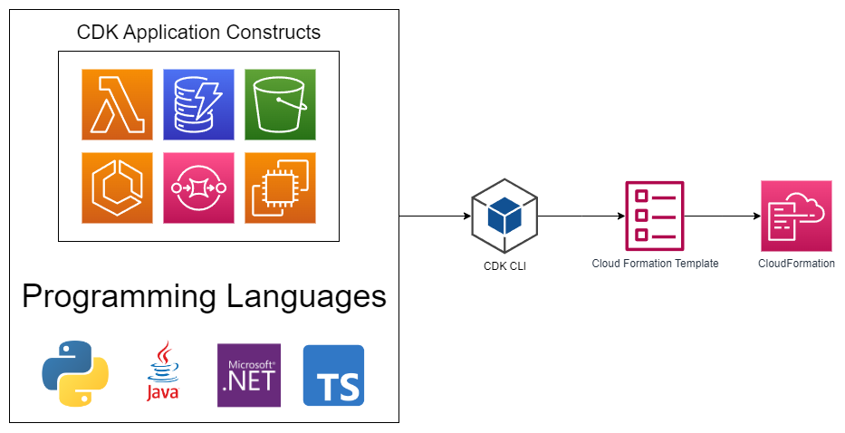

# AWS Cloud Development Kit<!-- omit in toc -->

## Contents <!-- omit in toc -->

- [1. Introduction](#1-introduction)
- [2. CDK in a diagram](#2-cdk-in-a-diagram)
- [3. CDK vs SAM](#3-cdk-vs-sam)

# 1. Introduction

- Define your cloud infrastructure using a familiar language:
  - JavaScript/TypeScript.
  - Python.
  - Java.
  - .NET.
- Contains high level components called **constructs**.
- The code is "compiled" into a CloudFormation template (JSON/YAML).
- You can therefore deploy infrastructure and application runtime code together.
  - Great for Lambda functions.
  - Great for Docker containers in ECS / EKS.

# 2. CDK in a diagram

# 3. CDK vs SAM

- **SAM:**
  - Serverless focused.
  - Write your template declaratively in JSON or YAML.
  - Great for quickly getting started with Lambda.
  - Leverages CloudFormation.
- **CDK:**
  - All AWS services.
  - Write infra in a programming language:
    - JavaScript/TypeScript.
    - Python.
    - Java.
    - .NET.
  - Leverages CloudFormation.
