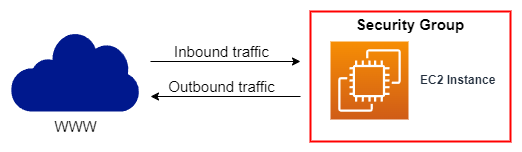
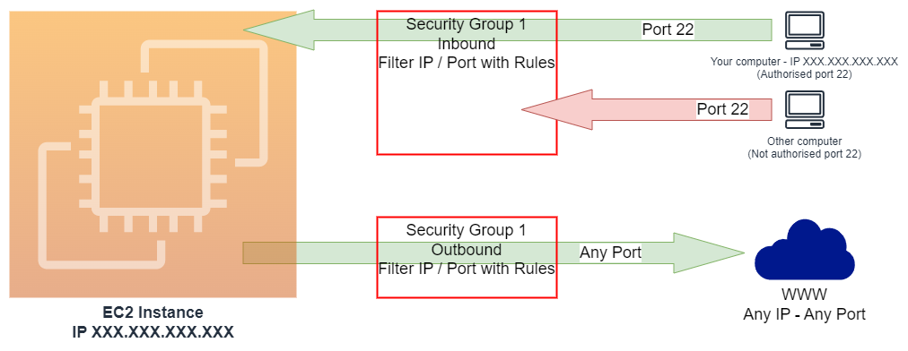

# AWS EC2 - Elastic Compute Cloud<!-- omit in toc -->

## Contents <!-- omit in toc -->

- [1. Introduction](#1-introduction)
- [2. Sizing \& configuration options](#2-sizing--configuration-options)
- [3. User Data](#3-user-data)
- [4. EC2 Instance Types - Overview](#4-ec2-instance-types---overview)
  - [4.1. General Purpose](#41-general-purpose)
  - [4.2. Compute Optimized](#42-compute-optimized)
  - [4.3. Memory Optimized](#43-memory-optimized)
  - [4.4. Storage Optimized](#44-storage-optimized)
  - [4.5. EC2 Instance Types: example](#45-ec2-instance-types-example)
- [5. Introduction to Security Groups](#5-introduction-to-security-groups)
  - [5.1. Security Groups Deeper Dive](#51-security-groups-deeper-dive)
  - [5.2. Security Groups Good to know](#52-security-groups-good-to-know)
- [6. Classic Ports to know](#6-classic-ports-to-know)
- [7. How to SSH into your EC2 Instance](#7-how-to-ssh-into-your-ec2-instance)
- [8. Elastic IP](#8-elastic-ip)
- [9. EC2 Instance Connect](#9-ec2-instance-connect)
- [10. EC2 Instances Purchasing Options](#10-ec2-instances-purchasing-options)
  - [10.1. On Demand](#101-on-demand)
  - [10.2. Reserved Instances](#102-reserved-instances)
  - [10.3. Savings Plans](#103-savings-plans)
  - [10.4. Spot Instances](#104-spot-instances)
  - [10.5. Dedicated Hosts](#105-dedicated-hosts)
  - [Dedicated Instances](#dedicated-instances)
  - [Capacity Reservations](#capacity-reservations)
  - [10.5.1. Which purchasing option is right for me? (Correlation with Hotel)](#1051-which-purchasing-option-is-right-for-me-correlation-with-hotel)
  - [10.5.2. AWS License Manager](#1052-aws-license-manager)
  - [10.5.3. Shared Responsibility Model for EC2](#1053-shared-responsibility-model-for-ec2)

# 1. Introduction

- EC2 is one of the most popular of AWS' offering.
- EC2 = Elastic Compute Cloud = Infrastructure as a Service.
- It mainly consists in the capability of:
  - Renting virtual machines (EC2).
  - Storing data on virtual drives (EBS).
  - Distributing load across machines (ELB).
  - Scaling the services using an auto-scaling group (ASG).
- Knowing EC2 is fundamental to understand how the Cloud works.

# 2. Sizing & configuration options

- Operating System **(OS)**: Linux, Windows or Mac OS.
- How much compute power & cores **(CPU)**.
- How much random-access memory **(RAM)**.
- How much storage space:
  - Network-attached **(EBS & EFS)**.
  - Hardware **(EC2 Instance Store)**.
- Network card: Speed of the card, Public IP address.
- Firewall rules: **Security group**.
- Bootstrap script (configure at first launch): EC2 User Data.

# 3. User Data

- It is possible to bootstrap our instances using an **EC2 User data** script.
- **Bootstrapping** means launching commands when a machine starts.
- That script is **only run once** at the instance **first start**.
- EC2 user data is used to automate boot tasks such as:
  - Installing updates.
  - Installing software.
  - Downloading common files from the internet.
  - Anything you can think of.
- The EC2 User Data Script runs with the root user.

# 4. EC2 Instance Types - Overview

- You can use different types of EC2 instances that are optimised for different use cases (https://aws.amazon.com/ec2/instance-types/).
- AWS has the following naming convention:
  - **m**_5_.`2xlarge`
    - **m:** instance class.
    - _5:_ generation (AWS improves them over time).
    - `2xlarge:` size within the instance class.

## 4.1. General Purpose

- Great for a diversity of workloads such as web servers or code repositories.
- Balance between:
  - Compute.
  - Memory.
  - Networking.

## 4.2. Compute Optimized

- **AWS Compute Optimizer recommends optimal AWS resources for your workloads to reduce costs and improve performance by using machine learning to analyze historical utilization metrics.**
- Great for compute-intensive tasks that require high performance processors:
  - Batch processing workloads.
  - Media transcoding.
  - High performance web servers.
  - High performance computing (HPC).
  - Scientific modeling & machine learning.
  - Dedicated gaming servers.

## 4.3. Memory Optimized

- Fast performance for workloads that process large data sets in memory.
- Use cases:
  - High performance, relational/non-relational databases.
  - Distributed web scale cache stores.
  - In-memory databases optimized for BI (business intelligence).
  - Applications performing real-time processing of big unstructured data.

## 4.4. Storage Optimized

- Great for storage-intensive tasks that require high, sequential read and write access to large data sets on local storage.
- Use cases:
  - High frequency online transaction processing (OLTP) systems.
  - Relational & NoSQL databases.
  - Cache for in-memory databases (for example, Redis).
  - Data warehousing applications.
  - Distributed file systems.

## 4.5. EC2 Instance Types: example

| Instance    | vCPU | Mem (GiB) | Storage          | Network performance | EBS Banwidth () |
| ----------- | ---- | --------- | ---------------- | ------------------- | --------------- |
| t2.micro    | 1    | 1         | EBS-Only         | Low to Moderate     |                 |
| t2.xlarge   | 4    | 16        | EBS-Only         | Moderate            |                 |
| c5d.4xlarge | 16   | 32        | 1 x 400 NVMe SSD | Up to 10 Gbps       | 4,750           |
| r5.16xlarge | 64   | 512       | EBS-Only         | 20 Gbps             | 13,600          |
| m5.8xlarge  | 32   | 128       | EBS-Only         | 10 Gbps             | 6,800           |

- **t2.micro is part of the AWS free tier (up to 750 hours per month).**

# 5. Introduction to Security Groups

- Security Groups are the fundamental of network security in AWS.
- They control how traffic is allowed into or out of our EC2 Instances.

  

- Security groups only contain **allow** rules.
- Security groups rules can reference by IP or by security group.

## 5.1. Security Groups Deeper Dive

- Security groups are acting as a "firewall" on EC2 instances.
- They regulate:

  - Access to Ports.
  - Authorised IP ranges IPv4 and IPv6.
  - Control of inbound network (from other to the instance).
  - Control of outbound network (from the instance to other).

  

## 5.2. Security Groups Good to know

- Can be attached to multiple instances.
- Locked down to a region / VPC combination.
- Does live "outside" the EC2 - if traffic is blocked the EC2 instance won't see it.
- **It's good to maintain one separate security group for SSH access.**
- If your application is not accessible (time out), then it's a security group issue.
- If your application gives a "connection refused" error, then it's an application error or it's not launched.
- All inbound traffic is **blocked** by default.
- All outbound traffic is **authorised** by default.

# 6. Classic Ports to know

- 22 = SSH (Secure Shell) - log into a Linux instance.
- 21 = FTP (File Transfer Protocol) - upload files into a file share.
- 22 = SFTP (Secure File Transfer Protocol) - upload files using SSH.
- 80 = HTTP - access unsecured websites.
- 443 = HTTPS - access secured websites.
- 3389 = RDP (Remote Desktop Protocol) - log into a Windows instance.

# 7. How to SSH into your EC2 Instance

- Windows:
  - We'll learn how to SSH into your EC2 instance using Windows.
  - Configure pem file
    
  - Command
    - ssh -i D:\MY_PENFILE.pem ec2-user@PUBLIC_IP.

# 8. Elastic IP

- An Elastic IP address is a reserved public IP address that you can assign to any EC2 instance in a particular region, until you choose to release it.
- To allocate an Elastic IP address to your account in a particular region, see Allocate an Elastic IP address.

# 9. EC2 Instance Connect

- Connect to your EC2 instance within your browser.
- No need to use your key file that was downloaded.
- The "magic" is that a temporary key is uploaded onto EC2 by AWS.
- **Works only out-of-the-box with Amazon Linux 2.**
- Need to make sure the port 22 is still opened!

# 10. EC2 Instances Purchasing Options

- **On-Demand Instances:** Short workload, predictable pricing.
- **Reserved:** (MINIMUM 1 year)
  - **Reserved Instances:** Long workloads.
  - **Convertible Reserved Instances:** Long workloads with flexible instances.
  - **Scheduled Reserved Instances:** Example - every Thursday between 3 and 6 pm.
- **Savings Plans (1 & 3 years):** Commitment to an amount of usage, long workload.
- **Spot Instances:** Short workloads, cheap, can lose instances (less reliable).
- **Dedicated Hosts:** Book an entire physical server, control instance placement.
- **Dedicated Instances:** No other customers will share your hardware.
- **Capacity Reservations:** Reserve capacity in a specific AZ for any duration.

## 10.1. On Demand

- Pay for what you use:
  - Linux or Windows - billing per second, after the first minute.
  - All other operating systems - billing per hour.
- Has the highest cost but no upfront payment.
- No long-term commitment.
- Recommended for **short-term** and **un-interrupted workloads**, where you can't predict how the application will behave.

## 10.2. Reserved Instances

- Up to **72% Confirm...** discount compared to On-demand.
- Your reserve a specific instance attributes **(Instance, type, region, tenancy, OS)**.
- Reservation period: **1 year** = + discount | **3 years** = +++ discount.
- Payment options: **No Upfront** = + | **partial upfront** = ++ | **All upfront** = +++ discount.
- **Reserved Instance's Scope:** Regional or Zonal (reserve capacity in an AZ).
- Recommended for steady-state usage applications (think database).
- You can buy and sell in the Reserved Instance Marketplace.
- **Convertible Reserved Instance**
  - Can change the EC2 instance type, instance family, OS, scope and tenancy.
  - Up to **66% confirm...** discount.
- Scheduled Reserved Instances
  - Launch within time window you reserve.
  - When you require a fraction of day / week / month.
  - Commitment for 1 year only.

## 10.3. Savings Plans

- Get a discount based on long-term usage (up to 72% - same as RIs).
- Commit to a certain type of usage ($10/hour for 1 or 3 years).
- Usage beyond EC2 Savings Plans is billed at the On-Demand price.
- Locked to a specific instance family & AWS region (e.g., M5 in us-east-1).
- Flexible across:
  - Instance Size (e.g., m5.xlarge, m5.2xlarge).
  - OS (e.g., Linux, Windows).
  - Tenancy (Host, Dedicated, Default).

## 10.4. Spot Instances

- Can get a **discount of up to 90%** compared to On-demand.
- Instances that you can "lose" at any point of time if your max price is less than the current spot price.
- The **MOST cost-efficient** instances in AWS.
- **Useful for workloads that are resilient to failure:**
  - Batch jobs.
  - Data analysis.
  - Image processing.
  - Any **distributed** workloads.
  - Workloads with a flexible start and end time.
- **Not suitable for critical jobs or databases.**

## 10.5. Dedicated Hosts

- **An Amazon EC2 Dedicated Host is a physical server with EC2 instance capacity fully dedicated to your use. Dedicated Hosts can help you address compliance requirements and reduce costs by allowing you to use your existing server-bound software licenses.**
- A physical server with EC2 instance capacity fully dedicated to your use.
- Allows you address **compliance requirements** and **use your existing server - bound software licenses** (per-socket, per-core, pe—VM software licenses).
- Purchasing Options:
  - **On-demand:** pay per second for active Dedicated Host.
  - **Reserved:** 1 or 3 years (No Upfront, Partial Upfront, All Upfront).
- **The most expensive option.**
- Useful for software that have complicated licensing model (BYOL - Bring Your Own License).
- Or for companies that have strong regulatory or compliance needs.

## Dedicated Instances

- Instances running on hardware that's dedicated to you.
- May share hardware with other instances in same account.
- No control over instance placement (can move hardware after Stop / Start).

## Capacity Reservations

- Reserve **On-Demand** instances capacity in a specific AZ for any duration.
- You always have access to EC2 capacity when you need it.
- **No time commitment** (create/cancel anytime), **no billing discounts**.
- Combine with Regional Reserved Instances and Savings Plans to benefit from billing discounts.
- You're charged at On-Demand rate whether you run instances or not.
- Suitable for short-term, uninterrupted workloads that needs to be in a specific AZ.

## 10.5.1. Which purchasing option is right for me? (Correlation with Hotel)

- **On demand:** coming and staying in resort whenever we like, we pay the full price.
- **Reserved:** like planning ahead and if we plan to stay for a long time, we may get a good discount.
- **Savings Plans:** pay a certain amount per hour for certain period and stay in any room type (e.g, King, Suite, Sea View, ...).
- **Spot instances:** the hotel allows people to bid for the empty rooms and the highest bidder keeps the rooms. You can get kicked out at any time.
- **Dedicated Hosts:** We book an entire building of the resort.
- **Capacity Reservations:** you book a room for a period with full price even you don't stay in it.

## 10.5.2. AWS License Manager

- AWS License Manager makes it easier to manage your software licenses from vendors such as Microsoft, SAP, Oracle, and IBM across AWS and on-premises environments.
- AWS License Manager lets administrators create customized licensing rules that mirror the terms of their licensing agreements.
- Administrators can use these rules to help prevent licensing violations, such as using more licenses than an agreement stipulates.
- Rules in AWS License Manager help prevent a licensing breach by stopping the instance from launching or by notifying administrators about the infringement.
- Administrators gain control and visibility of all their licenses with the AWS License Manager dashboard and reduce the risk of non-compliance, misreporting, and additional costs due to licensing overages.
- Independent software vendors (ISVs) can also use AWS License Manager to easily distribute and track licenses.

## 10.5.3. Shared Responsibility Model for EC2

- AWS:
  - Infrastructure (global network security)
  - Isolation on physical hosts
  - Replacing faulty hardware
  - Compliance validation
- You:
  - Security Groups rules
  - Operating-system patches and updates
  - Software and utilities installed on the EC2 instance
  - IAM Roles assigned to EC2ASDASD\_\_& IAM user access management
  - Data security on your instance
