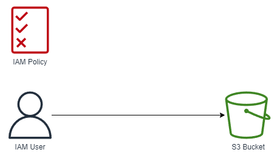
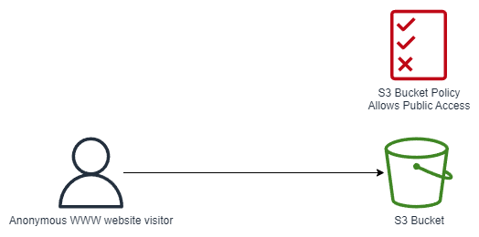

# AWS S3 - Simples Storage Service <!-- omit in toc -->

## Contents <!-- omit in toc -->

- [1. Introduction](#1-introduction)
- [2. S3 Use cases](#2-s3-use-cases)
- [3. Buckets](#3-buckets)
- [4. Objects](#4-objects)
- [5. Security](#5-security)
  - [5.1. Bucket Policies](#51-bucket-policies)
  - [5.2. Bucket settings for Block Public Access](#52-bucket-settings-for-block-public-access)
- [6. Static Website Hosting](#6-static-website-hosting)
- [7. Versioning](#7-versioning)
- [8. Access Logs](#8-access-logs)
- [9. Replication (CRR \& SRR)](#9-replication-crr--srr)
  - [9.1. Replication (Notes)](#91-replication-notes)
- [10. Storage Classes](#10-storage-classes)
  - [10.1. Durability and Availability](#101-durability-and-availability)
  - [10.2. Standard - General Purposes](#102-standard---general-purposes)
  - [10.3. S3 Storage Classes - Infrequent Access](#103-s3-storage-classes---infrequent-access)
  - [10.4. Amazon S3 Glacier Storage Classes](#104-amazon-s3-glacier-storage-classes)
  - [10.5. S3 Intelligent-Tiering](#105-s3-intelligent-tiering)
  - [10.6. S3 Storage Classes Comparison](#106-s3-storage-classes-comparison)
- [11. Princing](#11-princing)
- [12. Encryption](#12-encryption)
- [13. Shared Responsibility Model for S3](#13-shared-responsibility-model-for-s3)

# 1. Introduction

- Amazon S3 is one of the main building blocks of AWS.
- It's advertised as "infinitely scaling" storage.
- Many websites use Amazon S3 as a backbone.
- Many AWS services use Amazon S3 as an integration as well.

# 2. S3 Use cases

- Backup and storage.
- Disaster Recovery.
- Archive.
- Hybrid Cloud storage.
- Application hosting.
- Media hosting.
- Data lakes & big data analytics.
- Software delivery.
- Static website.

# 3. Buckets

- Amazon S3 allows people to store objects (files) in "buckets" (directories).
- Buckets must have a **globally unique name (across all regions all accounts)**.
- Buckets are defined at the region level.
- S3 looks like a global service but buckets are created in a region.
- Naming convention:
  - No uppercase, no underscore.
  - 3-63 characters long.
  - Not an IP.
  - Must start with lowercase letter or number.
  - Must NOT start with the prefix **xn--**.
  - Must NOT end with the suffix **-s3alias**.

# 4. Objects

- Objects (files) have a Key.
- The **key** is the **FULL** path:
  - s3://my-bucket/**my_file.txt**
  - s3://my-bucket/**my_folder1/another_folder/my_file.txt**
- The key is composed of **prefix** + _object name_
  - s3://my-bucket/**my_folder1/another_folder/**_my_file.txt_
- There's no concept of "directories" within buckets (although the UI will trick you to think otherwise).
- Just keys with very long names that contain slashes ("/").
- Object values are the content of the body:
  - Max Object Size is 5TB (5000GB).
  - If uploading more than 5GB, must use "multi-part upload".
- **Metadata** (List of text key / value pairs - system or user metadata).
- **Tags** (Unicode key / value pair - up to 10) - useful for security / lifecycle.
- Version ID (if versioning is enabled).

# 5. Security

- **User based:**
  - **IAM policies:** Which API calls should be allowed for a specific user from IAM console.




- **Resource Based:**
  - **Bucket Policies:** bucket wide rules from the S3 console - allows cross account.
  - **Object Access Control List (ACL):** finer grain (Can be disabled).
  - **Bucket Access Control List (ACL):** less common (Can be disabled).



- **Note:** An IAM principal can access an S3 object if:
  - The user IAM permissions **ALLOW** it **OR** the resource policy **ALLOWS** it.
  - **AND** there's no explicit **DENY**.
- **Encryption:** encrypt objects in Amazon S3 using encryption keys.

## 5.1. Bucket Policies

- **JSON based policies:**
  - Resources: buckets and objects
  - Actions: Set of API to Allow or Deny
  - Effect: Allow / Deny
  - Principal: The account or user to apply the policy to
- **Use S3 bucket for policy to:**
  - Grant public access to the bucket
  - Force objects to be encrypted at upload
  - Grant access to another account (Cross Account)

```
{
    "Version": "2012-10-17",
    "Id": "Policy1648843736704",
    "Statement": [
        {
            "Sid": "Stmt1648843733338",
            "Effect": "Allow",
            "Principal": "*",
            "Action": "s3:GetObject",
            "Resource": "arn:aws:s3:::test-bucket-jefte-goes/*"
        }
    ]
}
```

## 5.2. Bucket settings for Block Public Access


- **These settings were created to prevent company data leaks.**
- If you know your bucket should never be public, leave these on.
- Can be set at the account level.

# 6. Static Website Hosting

- S3 can host static websites and have them accessible on the Internet.
- The website URL will be (depending on the region):
  - https://**bucket-name**.s3-website-**aws-region**.amazonaws.com
- If you get a **403 Forbidden** error, make sure the bucket policy allows public reads.

# 7. Versioning

- You can version your files in Amazon S3.
- It is enabled at the **bucket level**.
- Same key overwrite will increment the "version": 1, 2, 3...
- It is best practice to version your buckets:
  - Protect against unintended deletes (ability to restore a version).
  - Easy roll back to previous version.
- Notes:
  - Any file that is not versioned prior to enabling versioning will have version **"null"**.
  - Suspending versioning does not delete the previous versions.

# 8. Access Logs

- For audit purpose, you may want to log all access to S3 buckets.
- Any request made to S3, from any account, authorized or denied, will be logged into another S3 bucket.
- That data can be analyzed using data analysis tools...
- Very helpful to come down to the root cause of an issue, or audit usage, view suspicious patterns, etc...

# 9. Replication (CRR & SRR)

- **Must enable versioning** in source and destination.
- **Cross Region Replication (CRR).**
- **Same Region Replication (SRR).**
- Buckets can be in different accounts.
- Copying is asynchronous.
- Must give proper IAM permissions to S3.
- Use cases:
  - **CRR:** compliance, lower latency access, replication across accounts.
  - **SRR:** log aggregation, live replication between production and test accounts.

## 9.1. Replication (Notes)

- After you enable Replication, only new objects are replicated.
- Optionally, you can replicate existing objects using **S3 Batch Replication**.
  - Replicates existing objects and objects that failed replication.
- For DELETE operations:
  - Can replicate delete markers from source to target (optional setting).
  - Deletions with a version ID are not replicated (to avoid malicious deletes).
- **There is no "chaining" of replication**
  - If bucket 1 has replication into bucket 2, which has replication into bucket 3.
  - Then objects created in bucket 1 are not replicated to bucket 3.

# 10. Storage Classes

- **Standart:**
  - Amazon S3 Standard - General Purpose.
  - Amazon S3 Standard-Infrequent Access (IA).
  - Amazon S3 One Zone-Infrequent Access.
- **Glacier:**
  - Amazon S3 Glacier Instant Retrieval.
  - Amazon S3 Glacier Flexible Retrieval.
  - Amazon S3 Glacier Deep Archive.
- **Intelligent Tiering:**
  - Amazon S3 Intelligent Tiering.
- **Can move between classes manually or using S3 Lifecycle configurations**.

## 10.1. Durability and Availability

- **Durability:**
  - High durability (99.999999999%, 11 9's) of objects across multiple AZ.
  - If you store 10,000,000 objects with Amazon S3, you can on average expect to incur a loss of a single object once every 10,000 years.
  - Same for all storage classes.
- **Availability:**
  - Measures how readily available a service is.
  - Varies depending on storage class.
  - Example: S3 standard has 99.99% availability, which means it will not be available 53 minutes a year.

## 10.2. Standard - General Purposes

- 99.99% Availability.
- Used for frequently accessed data.
- Low latency and high throughput.
- Sustain 2 concurrent facility failures.
- Use Cases: Big Data analytics, mobile & gaming applications, content distribution...

## 10.3. S3 Storage Classes - Infrequent Access

- For data that is less frequently accessed, but requires rapid access when needed.
- Lower cost than S3 Standard.
- **Amazon S3 Standard-Infrequent Access (S3 Standard-IA):**
  - 99.9% Availability.
  - Use cases: Disaster Recovery, backups.
- **Amazon S3 One Zone-Infrequent Access (S3 One Zone-IA):**
  - High durability (99.999999999%) in a single AZ; data lost when AZ is destroyed.
  - 99.5% Availability.
  - Use Cases: Storing secondary backup copies of on-premises data, or data you can recreate.

## 10.4. Amazon S3 Glacier Storage Classes

- Low-cost object storage meant for archiving / backup.
- Pricing: price for storage + object retrieval cost.
- **Amazon S3 Glacier Instant Retrieval:**
  - Millisecond retrieval, great for data accessed once a quarter.
  - Minimum storage duration of 90 days.
- **Amazon S3 Glacier Flexible Retrieval (formerly Amazon S3 Glacier):**
  - Expedited (1 to 5 minutes), Standard (3 to 5 hours), Bulk (5 to 12 hours) - free.
  - Minimum storage duration of 90 days.
- **Amazon S3 Glacier Deep Archive - for long term storage:**
  - Standard (12 hours), Bulk (48 hours).
  - Minimum storage duration of 180 days.

## 10.5. S3 Intelligent-Tiering

- Small monthly monitoring and auto-tiering fee.
- Moves objects automatically between Access Tiers based on usage.
- There are no retrieval charges in S3 Intelligent-Tiering.
- **Frequent Access tier (automatic):** default tier.
- **Infrequent Access tier (automatic):** objects not accessed for 30 days.
- **Archive Instant Access tier (automatic):** objects not accessed for 90 days.
- **Archive Access tier (optional):** configurable from 90 days to 700+ days.
- **Deep Archive Access tier (optional):** config. from 180 days to 700+ days.

## 10.6. S3 Storage Classes Comparison

[Storage Classes Comparison](https://aws.amazon.com/s3/storage-classes/)

# 11. Princing

[S3 Pricing](https://aws.amazon.com/s3/pricing/)

# 12. Encryption

- Types:
  - No Encryption
  - Server-Side Encryption
  - Client-Side Encryption

# 13. Shared Responsibility Model for S3

- Aws:
  - Infrastructure (global security, durability, availability, sustain concurrent loss of data in two facilities)
  - Configuration and vulnerability analysis
  - Compliance validation
- You:
  - S3 Versioning
  - S3 Bucket Policies
  - S3 Replication Setup
  - Logging and Monitoring
  - S3 Storage Classes
  - Data encryption at rest and in transit
