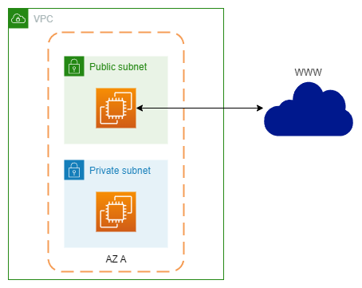
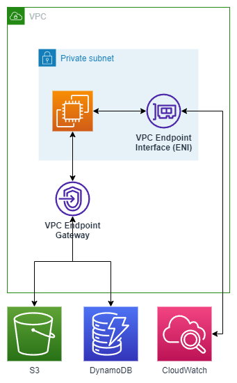

# AWS VPC<!-- omit in toc -->

## Contents <!-- omit in toc -->

- [1. VPC and Subnets Primer](#1-vpc-and-subnets-primer)
- [2. Internet Gateway and NAT Gateways](#2-internet-gateway-and-nat-gateways)
- [3. Network ACL and Security Groups](#3-network-acl-and-security-groups)
  - [3.1. Network ACLs vs Security Groups](#31-network-acls-vs-security-groups)
- [4. VPC Flow Logs](#4-vpc-flow-logs)
- [5. VPC Peering](#5-vpc-peering)
- [6. VPC Endpoints](#6-vpc-endpoints)
- [7. Site to Site VPN \& Direct Connect](#7-site-to-site-vpn--direct-connect)
- [8. Site-to-Site VPN](#8-site-to-site-vpn)
- [9. Transit Gateway](#9-transit-gateway)
- [10. VPC Closing Comments](#10-vpc-closing-comments)

# 1. VPC and Subnets Primer

- **A virtual private cloud (VPC) is a virtual network dedicated to your AWS account. It is logically isolated from other virtual networks in the AWS Cloud. You can launch your AWS resources, such as Amazon EC2 instances, into your VPC.**
- **VPC - Virtual Private Cloud:** private network to deploy your resources (regional resource).
- **Subnets** allow you to partition your network inside your VPC (Availability Zone resource).
- A **public subnet** is a subnet that is accessible from the internet.
- A **private subnet** is a subnet that is not accessible from the internet.
- To define access to the internet and between subnets, we use **Route Tables**.

# 2. Internet Gateway and NAT Gateways

- **NAT Gateways allow your instances in your private subnets to access the Internet while remaining private, and are managed by AWS.**
- **Internet Gateways** helps our VPC instances connect with the internet.
- Public Subnets have a route to the internet gateway.
- **NAT Gateways** (AWS-managed) and **NAT Instances** (self-managed) allow your instances in your **Private Subnets** to access the internet while remaining private.

# 3. Network ACL and Security Groups

- **A network access control list (NACL) is an optional layer of security for your VPC that acts as a firewall for controlling traffic in and out of one or more subnets.**
- **They have both ALLOW and DENY rules.**
- **NACL (Network ACL):**
  - A firewall which controls traffic from and to subnet.
  - Can have ALLOW and DENY rules.
  - Are attached at the **Subnet** level.
  - Rules only include IP addresses.
- **Security Groups:**
  - A firewall that controls traffic to and from **an ENI / an EC2 Instance**.
  - Can have only ALLOW rules.
  - Rules include IP addresses and other security groups.

## 3.1. Network ACLs vs Security Groups

| Security group                                                                                                                                               | Network ACL                                                                                                                                                                            |
| ------------------------------------------------------------------------------------------------------------------------------------------------------------ | -------------------------------------------------------------------------------------------------------------------------------------------------------------------------------------- |
| Operates at the instance level                                                                                                                               | Operates at the subnet level                                                                                                                                                           |
| Supports allow rules only                                                                                                                                    | Supports allow rules and deny rules                                                                                                                                                    |
| Is stateful: Return traffic is automatically allowed, regardless of any rules                                                                                | Is stateless: Return traffic must be explicitly allowed by rules                                                                                                                       |
| We evaluate all rules before deciding whether to allow traffic                                                                                               | We process rules in order, starting with the lowest numbered rule, when deciding whether to allow traffic                                                                              |
| Applies to an instance only if someone specifies the security group when launching the instance, or associates the security group with the instance later on | Automatically applies to all instances in the subnets that it's associated with (therefore, it provides an additional layer of defense if the security group rules are too permissive) |

- https://docs.aws.amazon.com/vpc/latest/userguide/VPC_Security.html

# 4. VPC Flow Logs

- Capture information about IP traffic going into your interfaces:
  - **VPC Flow** Logs.
  - **Subnet** Flow Logs.
  - **Elastic Network Interface** Flow Logs.
- Helps to monitor & troubleshoot connectivity issues. Example:
  - Subnets to internet.
  - Subnets to subnets.
  - Internet to subnets.
- Captures network information from AWS managed interfaces too: Elastic Load Balancers, ElastiCache, RDS, Aurora, etc...
- VPC Flow logs data can go to S3 / CloudWatch Logs.

# 5. VPC Peering

- Connect two VPC, privately using AWS' network.
- Make them behave as if they were in the same network.
- Must not have overlapping CIDR (IP address range).
- VPC Peering connection is not transitive (must be established for each VPC that need to communicate with one another).

# 6. VPC Endpoints

- Endpoints allow you to connect to AWS Services **using a private network** instead of the public www network.
- This gives you enhanced security and lower latency to access AWS services.
- VPC Endpoint **Gateway**: S3 & DynamoDB.
- VPC Endpoint **Interface**: the rest.

# 7. Site to Site VPN & Direct Connect

- **Site to Site VPN:**
  - Connect an on-premises VPN to AWS.
  - The connection is automatically encrypted.
  - Goes over the public internet.
- **AWS Direct Connect is a cloud service solution that makes it easy to establish a dedicated private network connection from your premises to AWS.**
  - **Direct Connect (DX):**
    - Establish a physical connection between on-premises and AWS.
    - The connection is private, secure and fast.
    - Goes over a private network.
    - Takes at least a month to establish.
- Note: **Site-to-site VPN** and **Direct Connect** cannot access **VPC endpoints**.

# 8. Site-to-Site VPN

- On-premises: must use a **Customer Gateway** (CGW)
- AWS: must use a **Virtual Private Gateway** (VGW)

# 9. Transit Gateway

- **Transit Gateway connects thousands of VPC and on-premises networks together in a single gateway.**
- For having transitive peering between thousands of VPC and on-premises, hub-and-spoke (star) connection.
- One single Gateway to provide this functionality.
- Works with Direct Connect Gateway, VPN connections.

# 10. VPC Closing Comments

- **VPC:** Virtual Private Cloud.
- **Subnets:** Tied to an AZ, network partition of the VPC.
- **Internet Gateway:** At the VPC level, provide Internet Access.
- **NAT Gateway / Instances:** Give internet access to private subnets.
- **NACL:** Stateless, subnet rules for inbound and outbound.
- **Security Groups:** Stateful, operate at the EC2 instance level or ENI.
- **VPC Peering:** Connect two VPC with non overlapping IP ranges, nontransitive.
- **VPC Endpoints:** Provide private access to AWS Services within VPC.
- **VPC Flow Logs:** Network traffic logs.
- **Site to Site VPN:** VPN over public internet between on-premises DC and AWS.
- **Direct Connect:** Direct private connection to AWS.
- **Transit Gateway:** Connect thousands of VPC and on-premises networks together.
