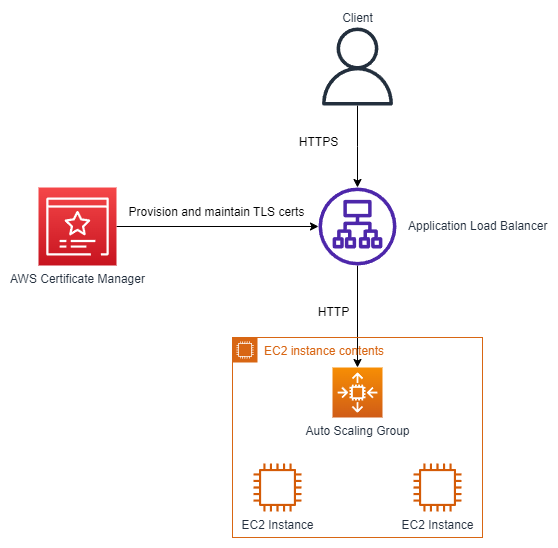

# Aws overview <!-- omit in toc -->

## Contents <!-- omit in toc -->

- [1. Traditionally, how to build infrastructure](#1-traditionally-how-to-build-infrastructure)
  - [1.1. How websites work](#11-how-websites-work)
  - [1.2. What is a server composed of?](#12-what-is-a-server-composed-of)
  - [1.3. IT Terminology](#13-it-terminology)
  - [1.4. Problems with traditional IT approach](#14-problems-with-traditional-it-approach)
- [2. What is Cloud Computing?](#2-what-is-cloud-computing)
  - [2.1. You've been using some Cloud services](#21-youve-been-using-some-cloud-services)
  - [2.2. The Deployment Models of the Cloud](#22-the-deployment-models-of-the-cloud)
    - [2.2.1. Private Cloud:](#221-private-cloud)
    - [2.2.2. Public Cloud:](#222-public-cloud)
    - [2.2.3. Hybrid Cloud:](#223-hybrid-cloud)
  - [2.3. The Five Characteristics of Cloud Computing](#23-the-five-characteristics-of-cloud-computing)
  - [2.4. Six Advantages of Cloud Computing](#24-six-advantages-of-cloud-computing)
  - [2.5. Problems solved by the Cloud](#25-problems-solved-by-the-cloud)
  - [2.6. Types of Cloud Computing](#26-types-of-cloud-computing)
  - [2.7. Example of Cloud Computing Types](#27-example-of-cloud-computing-types)
  - [2.8. Pricing of the Cloud - Quick Overview](#28-pricing-of-the-cloud---quick-overview)
  - [2.9. AWS Global Infrastructure](#29-aws-global-infrastructure)
  - [2.10. AWS Regions](#210-aws-regions)
  - [2.11. How to choose an AWS Region?](#211-how-to-choose-an-aws-region)
  - [2.12. AWS Availability Zones](#212-aws-availability-zones)
  - [2.13. AWS Points of Presence (Edge Locations)](#213-aws-points-of-presence-edge-locations)
  - [2.14. Tour of the AWS Console](#214-tour-of-the-aws-console)
  - [2.15. Shared Responsibility Model diagram](#215-shared-responsibility-model-diagram)
  - [2.16. AWS Acceptable Use Policy](#216-aws-acceptable-use-policy)
- [3. IAM - Identity and Access Management and AWS CLI](#3-iam---identity-and-access-management-and-aws-cli)
  - [3.1. IAM - Summary](#31-iam---summary)
- [4. EC2 - Elastic Compute Cloud](#4-ec2---elastic-compute-cloud)
  - [4.1. EC2 - Summary](#41-ec2---summary)
- [5. AWS EC2 EBS Elastic Block Storage](#5-aws-ec2-ebs-elastic-block-storage)
  - [5.1. EC2 EBS Summary](#51-ec2-ebs-summary)
- [6. AWS ELB - Elastic Load Balancing and AWS ASG - Auto Scaling Groups](#6-aws-elb---elastic-load-balancing-and-aws-asg---auto-scaling-groups)
  - [6.22. ELB \& ASG - Summary](#622-elb--asg---summary)
- [7. Amazon S3](#7-amazon-s3)
  - [7.1. AWS Snow Family](#71-aws-snow-family)
  - [7.2. Data Migrations with AWS Snow Family](#72-data-migrations-with-aws-snow-family)
    - [7.2.1. AWS Snowcone](#721-aws-snowcone)
    - [7.2.2. Snowball Edge (for data transfers)](#722-snowball-edge-for-data-transfers)
    - [7.2.3. AWS Snowmobile](#723-aws-snowmobile)
  - [7.3. Snow Family - Usage Process](#73-snow-family---usage-process)
  - [7.4. What is Edge Computing?](#74-what-is-edge-computing)
  - [7.5. Snow Family - Edge Computing](#75-snow-family---edge-computing)
  - [7.6. AWS OpsHub](#76-aws-opshub)
  - [7.7. Hybrid Cloud for Storage](#77-hybrid-cloud-for-storage)
  - [7.8. AWS Storage Gateway](#78-aws-storage-gateway)
  - [7.9. Amazon S3 - Summary](#79-amazon-s3---summary)
- [8. Databases](#8-databases)
  - [8.1. Introduction](#81-introduction)
  - [8.2. Relational Databases](#82-relational-databases)
  - [8.3. NoSQL Databases](#83-nosql-databases)
  - [8.4. NoSQL data example: JSON](#84-nosql-data-example-json)
  - [8.5. Databases \& Shared Responsibility on AWS](#85-databases--shared-responsibility-on-aws)
  - [8.6. AWS RDS Overview](#86-aws-rds-overview)
  - [8.7. Advantage over using RDS versus deploying DB on EC2](#87-advantage-over-using-rds-versus-deploying-db-on-ec2)
  - [8.8. RDS Backups](#88-rds-backups)
  - [8.9. RDS - Storage Auto Scaling](#89-rds---storage-auto-scaling)
  - [8.10. RDS Deployments: Read Replicas, Multi-AZ, Multi-Region](#810-rds-deployments-read-replicas-multi-az-multi-region)
    - [8.10.1. Read Replicas](#8101-read-replicas)
    - [8.10.2. Multi-AZ](#8102-multi-az)
    - [8.10.3. Multi-Region](#8103-multi-region)
    - [8.10.4. Resume](#8104-resume)
  - [8.11. RDS - Read Replicas for read scalability](#811-rds---read-replicas-for-read-scalability)
    - [8.11.1. RDS - Read Replicas - Use Cases](#8111-rds---read-replicas---use-cases)
    - [8.11.2. RDS - Read Replicas - Network Cost](#8112-rds---read-replicas---network-cost)
    - [8.11.3. RDS - Multi AZ (Disaster Recovery)](#8113-rds---multi-az-disaster-recovery)
    - [8.11.4. RDS - From Single-AZ to Multi-AZ](#8114-rds---from-single-az-to-multi-az)
  - [8.12. RDS Security - Encryption](#812-rds-security---encryption)
  - [8.13. RDS - Encryption Operations](#813-rds---encryption-operations)
  - [8.14. RDS Security - Network \& IAM](#814-rds-security---network--iam)
  - [8.15. RDS - IAM Authentication](#815-rds---iam-authentication)
  - [8.16. RDS Security - Summary](#816-rds-security---summary)
  - [8.17. Amazon Aurora](#817-amazon-aurora)
  - [8.18. Aurora High Availability and Read Scaling](#818-aurora-high-availability-and-read-scaling)
  - [8.19. Features of Aurora](#819-features-of-aurora)
  - [8.20. Aurora Security](#820-aurora-security)
  - [8.21. Amazon ElastiCache Overview](#821-amazon-elasticache-overview)
  - [8.22. ElastiCache - Solution Architecture - DB Cache](#822-elasticache---solution-architecture---db-cache)
  - [8.23. ElastiCache - Solution Architecture - User Session Store](#823-elasticache---solution-architecture---user-session-store)
  - [8.24. ElastiCache - Redis vs Memcached](#824-elasticache---redis-vs-memcached)
  - [8.25. ElastiCache - Cache Security](#825-elasticache---cache-security)
  - [8.26. ElastiCache Replication](#826-elasticache-replication)
    - [8.26.1. Cluster Mode Disabled](#8261-cluster-mode-disabled)
    - [8.26.2. Cluster Mode Disabled](#8262-cluster-mode-disabled)
  - [8.27. Caching Implementation Considerations](#827-caching-implementation-considerations)
  - [8.28. Lazy Loading / Cache-Aside / Lazy Population](#828-lazy-loading--cache-aside--lazy-population)
  - [8.29. Write Through -Add or Update cache when database is updated](#829-write-through--add-or-update-cache-when-database-is-updated)
  - [8.30. Cache Evictions and Time-to-live (TTL)](#830-cache-evictions-and-time-to-live-ttl)
  - [8.31. Final words of wisdom](#831-final-words-of-wisdom)
  - [8.32. DynamoDB](#832-dynamodb)
  - [8.33. Redshift Overview](#833-redshift-overview)
  - [8.34. Amazon EMR](#834-amazon-emr)
  - [8.35. Amazon Athena](#835-amazon-athena)
  - [8.36. Amazon QuickSight](#836-amazon-quicksight)
  - [8.37. DocumentDB](#837-documentdb)
  - [8.38. Amazon Neptune](#838-amazon-neptune)
  - [8.39. Amazon QLDB](#839-amazon-qldb)
  - [8.40. Amazon Managed Blockchain](#840-amazon-managed-blockchain)
  - [8.41. AWS Glue](#841-aws-glue)
  - [8.42. DMS - Database Migration Service](#842-dms---database-migration-service)
  - [8.43. Databases \& Analytics Summary in AWS](#843-databases--analytics-summary-in-aws)
- [9. Other Compute Services: ECS, Lambda, Batch, Lightsail](#9-other-compute-services-ecs-lambda-batch-lightsail)
  - [9.1. ECS](#91-ecs)
  - [9.2. Fargate](#92-fargate)
  - [9.3. ECR](#93-ecr)
  - [9.4. Lambda](#94-lambda)
  - [9.5. Amazon API Gateway](#95-amazon-api-gateway)
  - [9.6. AWS Batch](#96-aws-batch)
  - [9.7. Batch vs Lambda](#97-batch-vs-lambda)
  - [9.8. Amazon Lightsail](#98-amazon-lightsail)
  - [9.9. Other Compute - Summary](#99-other-compute---summary)
  - [9.10. Lambda Summary](#910-lambda-summary)
- [10. Deploying and Managing Infrastructure at Scale](#10-deploying-and-managing-infrastructure-at-scale)
  - [10.1. What is CloudFormation?](#101-what-is-cloudformation)
    - [10.1.1. Benefits of AWS CloudFormation](#1011-benefits-of-aws-cloudformation)
    - [10.1.2. CloudFormation Stack Designer](#1012-cloudformation-stack-designer)
  - [10.2. AWS Cloud Development Kit (CDK)](#102-aws-cloud-development-kit-cdk)
  - [10.3. Developer problems on AWS](#103-developer-problems-on-aws)
  - [10.4. AWS Elastic Beanstalk Overview](#104-aws-elastic-beanstalk-overview)
  - [10.5. Elastic Beanstalk](#105-elastic-beanstalk)
    - [10.5.1. Health Monitoring](#1051-health-monitoring)
  - [10.6. AWS CodeDeploy](#106-aws-codedeploy)
  - [10.7. AWS CodeCommit](#107-aws-codecommit)
  - [10.8. AWS CodeBuild](#108-aws-codebuild)
  - [10.9. AWS CodePipeline](#109-aws-codepipeline)
  - [10.10. AWS CodeArtifact](#1010-aws-codeartifact)
  - [10.11. AWS CodeStar](#1011-aws-codestar)
  - [10.12. AWS Cloud9](#1012-aws-cloud9)
  - [10.13. AWS Systems Manager (SSM)](#1013-aws-systems-manager-ssm)
    - [10.13.1. How Systems Manager works?](#10131-how-systems-manager-works)
    - [10.13.2. Systems Manager - SSM Session Manager](#10132-systems-manager---ssm-session-manager)
  - [10.14. AWS OpsWorks](#1014-aws-opsworks)
  - [10.15. AWS Amplify](#1015-aws-amplify)
  - [10.16. Deployment - Summary](#1016-deployment---summary)
- [11. Route 53](#11-route-53)
  - [11.1. What is DNS?](#111-what-is-dns)
    - [11.1.1. DNS Terminologies](#1111-dns-terminologies)
- [12. Global Infrastructure](#12-global-infrastructure)
  - [12.1. Why make a global application?](#121-why-make-a-global-application)
  - [12.2. Global AWS Infrastructure](#122-global-aws-infrastructure)
  - [12.3. Global Applications in AWS](#123-global-applications-in-aws)
  - [12.4. Amazon Route 53 Overview](#124-amazon-route-53-overview)
    - [12.4.1. Route 53 policies](#1241-route-53-policies)
  - [12.5. AWS CloudFront](#125-aws-cloudfront)
  - [12.6. CloudFront - Origins](#126-cloudfront---origins)
  - [12.7. CloudFront vs S3 Cross Region Replication](#127-cloudfront-vs-s3-cross-region-replication)
  - [12.8. S3 Transfer Acceleration](#128-s3-transfer-acceleration)
  - [12.9. AWS Global Accelerator](#129-aws-global-accelerator)
  - [12.10. AWS Global Accelerator vs CloudFront](#1210-aws-global-accelerator-vs-cloudfront)
  - [12.11. AWS Outposts](#1211-aws-outposts)
  - [12.12. AWS WaveLength](#1212-aws-wavelength)
  - [12.13. AWS Local Zones](#1213-aws-local-zones)
  - [12.14. Global Applications Architecture](#1214-global-applications-architecture)
  - [12.15. Global Applications in AWS - Summary](#1215-global-applications-in-aws---summary)
  - [12.16. Global Applications in AWS - Summary](#1216-global-applications-in-aws---summary)
- [13. Cloud Integration](#13-cloud-integration)
  - [13.1. Amazon SQS - Standard Queue](#131-amazon-sqs---standard-queue)
  - [13.2. Amazon Kinesis](#132-amazon-kinesis)
  - [13.3. Amazon SNS](#133-amazon-sns)
  - [13.4. Amazon MQ](#134-amazon-mq)
  - [13.5. Integration - Summary](#135-integration---summary)
- [14. Cloud Monitoring](#14-cloud-monitoring)
  - [14.1. Amazon CloudWatch Metrics](#141-amazon-cloudwatch-metrics)
    - [14.1.1. Important Metrics](#1411-important-metrics)
  - [14.2. Amazon CloudWatch Alarms](#142-amazon-cloudwatch-alarms)
  - [14.3. Amazon CloudWatch Logs](#143-amazon-cloudwatch-logs)
  - [14.4. Amazon CloudWatch Events](#144-amazon-cloudwatch-events)
  - [14.5. Amazon EventBridge](#145-amazon-eventbridge)
  - [14.6. AWS CloudTrail](#146-aws-cloudtrail)
  - [14.7. AWS X-Ray](#147-aws-x-ray)
  - [14.8. Amazon CodeGuru](#148-amazon-codeguru)
  - [14.9. Amazon CodeGuru Reviewer](#149-amazon-codeguru-reviewer)
    - [14.9.1. Amazon CodeGuru Profiler](#1491-amazon-codeguru-profiler)
  - [14.10. AWS Status - Service Health Dashboard](#1410-aws-status---service-health-dashboard)
  - [14.11. AWS Personal Health Dashboard](#1411-aws-personal-health-dashboard)
  - [14.12. Monitoring Summary](#1412-monitoring-summary)
- [15. VPC](#15-vpc)
- [16. Security \& Compliance](#16-security--compliance)
  - [16.1. AWS Shared Responsibility Model](#161-aws-shared-responsibility-model)
    - [16.1.1. Example, for RDS](#1611-example-for-rds)
    - [16.1.2. Example, for S3](#1612-example-for-s3)
  - [16.2. DDOS Protection on AWS](#162-ddos-protection-on-aws)
  - [16.3. AWS Shield](#163-aws-shield)
  - [16.4. AWS WAF - Web Application Firewall](#164-aws-waf---web-application-firewall)
  - [16.5. Penetration Testing on AWS Cloud](#165-penetration-testing-on-aws-cloud)
  - [16.6. Data at rest vs. Data in transit](#166-data-at-rest-vs-data-in-transit)
  - [16.7. AWS KMS (Key Management Service)](#167-aws-kms-key-management-service)
  - [16.8. CloudHSM](#168-cloudhsm)
  - [16.9. Types of CMK (Customer Master Keys)](#169-types-of-cmk-customer-master-keys)
  - [16.10. AWS Certificate Manager (ACM)](#1610-aws-certificate-manager-acm)
  - [16.11. AWS Secrets Manager](#1611-aws-secrets-manager)
  - [16.12. AWS Artifact (not really a service)](#1612-aws-artifact-not-really-a-service)
  - [16.13. Amazon GuardDuty](#1613-amazon-guardduty)
  - [16.14. Amazon Inspector](#1614-amazon-inspector)
    - [16.14.1. What does AWS Inspector evaluate?](#16141-what-does-aws-inspector-evaluate)
  - [16.15. AWS Config](#1615-aws-config)
  - [16.16. Amazon Macie](#1616-amazon-macie)
  - [16.17. AWS Security Hub](#1617-aws-security-hub)
  - [16.18. Amazon Detective](#1618-amazon-detective)
  - [16.19. AWS Abuse](#1619-aws-abuse)
  - [16.20. Root user privileges](#1620-root-user-privileges)
  - [16.21. Summary: Security \& Compliance](#1621-summary-security--compliance)
- [17. Machine Learning](#17-machine-learning)
  - [17.1. Amazon Rekognition](#171-amazon-rekognition)
  - [17.2. Amazon Transcribe](#172-amazon-transcribe)
  - [17.3. Amazon Polly](#173-amazon-polly)
  - [17.4. Amazon Translate](#174-amazon-translate)
  - [17.5. Amazon Lex \& Connect](#175-amazon-lex--connect)
  - [17.6. Amazon Comprehend](#176-amazon-comprehend)
  - [17.7. Amazon SageMaker](#177-amazon-sagemaker)
  - [17.8. Amazon Forecast](#178-amazon-forecast)
  - [17.9. Amazon Kendra](#179-amazon-kendra)
  - [17.10. Amazon Personalize](#1710-amazon-personalize)
  - [17.11. AWS Machine Learning - Summary](#1711-aws-machine-learning---summary)
- [18. Account Management, Billing \& Support](#18-account-management-billing--support)
  - [18.1. AWS Organizations](#181-aws-organizations)
    - [18.1.1. Multi Account Strategies](#1811-multi-account-strategies)
    - [18.1.2. Service Control Policies (SCP)](#1812-service-control-policies-scp)
    - [18.1.3. AWS Organization - Consolidated Billing](#1813-aws-organization---consolidated-billing)
  - [18.2. AWS Control Tower](#182-aws-control-tower)
  - [18.3. Pricing Models in AWS](#183-pricing-models-in-aws)
    - [18.3.1. Free services \& free tier in AWS](#1831-free-services--free-tier-in-aws)
    - [18.3.2. Compute Pricing - EC2](#1832-compute-pricing---ec2)
    - [18.3.3. Compute Pricing - Lambda \& ECS](#1833-compute-pricing---lambda--ecs)
    - [18.3.4. Storage Pricing - S3](#1834-storage-pricing---s3)
    - [18.3.5. Storage Pricing - EBS](#1835-storage-pricing---ebs)
    - [18.3.6. Database Pricing - RDS](#1836-database-pricing---rds)
    - [18.3.7. Content Delivery - CloudFront](#1837-content-delivery---cloudfront)
      - [18.3.7.1. Networking Costs in AWS per GB - Simplified](#18371-networking-costs-in-aws-per-gb---simplified)
    - [18.3.8. Savings Plan](#1838-savings-plan)
  - [18.4. AWS Compute Optimizer](#184-aws-compute-optimizer)
  - [18.5. Billing and Costing Tools](#185-billing-and-costing-tools)
  - [18.6. AWS Pricing Calculator](#186-aws-pricing-calculator)
  - [18.7. AWS Billing Dashboard](#187-aws-billing-dashboard)
    - [18.7.1. Cost Allocation Tags](#1871-cost-allocation-tags)
    - [18.7.2. Tagging and Resource Groups](#1872-tagging-and-resource-groups)
    - [18.7.3. Cost and Usage Reports](#1873-cost-and-usage-reports)
    - [18.7.4. Cost Explorer](#1874-cost-explorer)
  - [18.8. Billing Alarms in CloudWatch](#188-billing-alarms-in-cloudwatch)
  - [18.9. AWS Budgets](#189-aws-budgets)
  - [18.10. Trusted Advisor](#1810-trusted-advisor)
  - [18.11. Trusted Advisor - Support Plans](#1811-trusted-advisor---support-plans)
  - [18.12. AWS Support Plans Pricing](#1812-aws-support-plans-pricing)
    - [18.12.1. AWS Basic Support Plan](#18121-aws-basic-support-plan)
    - [18.12.2. AWS Developer Support Plan](#18122-aws-developer-support-plan)
    - [18.12.3. AWS Business Support Plan (24/7)](#18123-aws-business-support-plan-247)
    - [18.12.4. AWS Enterprise On-Ramp Support Plan (24/7)](#18124-aws-enterprise-on-ramp-support-plan-247)
    - [18.12.5. AWS Enterprise Support Plan (24/7)](#18125-aws-enterprise-support-plan-247)
  - [18.13. Account Best Practices - Summary](#1813-account-best-practices---summary)
  - [18.14. Billing and Costing Tools - Summary](#1814-billing-and-costing-tools---summary)
- [19. Advanced Identity](#19-advanced-identity)
  - [19.1. AWS STS (SecurityToken Service)](#191-aws-sts-securitytoken-service)
  - [19.2. Amazon Cognito](#192-amazon-cognito)
  - [19.3. What is Microsoft Active Directory (AD)?](#193-what-is-microsoft-active-directory-ad)
    - [19.3.1. AWS Directory Services](#1931-aws-directory-services)
  - [19.4. AWS Organizations](#194-aws-organizations)
  - [19.5. AWS Single Sign-On (SSO)](#195-aws-single-sign-on-sso)
  - [19.6. Advanced Identity - Summary](#196-advanced-identity---summary)
- [20. Other AWS Services](#20-other-aws-services)
  - [20.1. Amazon WorkSpaces](#201-amazon-workspaces)
  - [20.2. Amazon AppStream 2.0](#202-amazon-appstream-20)
    - [20.2.1. Amazon AppStream 2.0 vs WorkSpaces](#2021-amazon-appstream-20-vs-workspaces)
  - [20.3. Amazon Sumerian](#203-amazon-sumerian)
  - [20.4. AWS IoT Core](#204-aws-iot-core)
  - [20.5. Amazon Elastic Transcoder](#205-amazon-elastic-transcoder)
  - [20.6. AWS Device Farm](#206-aws-device-farm)
  - [20.7. AWS Backup](#207-aws-backup)
    - [20.7.1. Disaster Recovery Strategies](#2071-disaster-recovery-strategies)
  - [20.8. AWS Elastic Disaster Recovery (DRS)](#208-aws-elastic-disaster-recovery-drs)
  - [20.9. AWS DataSync](#209-aws-datasync)
  - [20.10. AWS Fault Injection Simulator (FIS)](#2010-aws-fault-injection-simulator-fis)
  - [20.11. AWS Step Functions](#2011-aws-step-functions)
  - [20.12. Amazon AppFlow](#2012-amazon-appflow)
  - [20.13. AWS CloudSearch](#2013-aws-cloudsearch)
  - [20.14. Aws Service Catalog](#2014-aws-service-catalog)
  - [20.15. Amazon AWS SES - Simple Email Service](#2015-amazon-aws-ses---simple-email-service)
- [21. AWS Architecting \& Ecosystem](#21-aws-architecting--ecosystem)
  - [21.1. Well Architected Framework General - Guiding Principles](#211-well-architected-framework-general---guiding-principles)
  - [21.2. AWS Cloud Best Practices - Design Principles](#212-aws-cloud-best-practices---design-principles)
  - [21.3. Well Architected Framework 6 Pillars](#213-well-architected-framework-6-pillars)
    - [21.3.1. Operational Excellence](#2131-operational-excellence)
      - [21.3.1.1. Operational Excellence AWS Services](#21311-operational-excellence-aws-services)
    - [21.3.2. Security](#2132-security)
      - [21.3.2.1. Security AWS Services](#21321-security-aws-services)
    - [21.3.3. Reliability](#2133-reliability)
      - [21.3.3.1. Reliability AWS Services](#21331-reliability-aws-services)
    - [21.3.4. Performance Efficiency](#2134-performance-efficiency)
      - [21.3.4.1. Performance Efficiency AWS Services](#21341-performance-efficiency-aws-services)
    - [21.3.5. Cost Optimization](#2135-cost-optimization)
      - [21.3.5.1. Cost Optimization AWS Services](#21351-cost-optimization-aws-services)
    - [21.3.6. Sustainability](#2136-sustainability)
      - [21.3.6.1. Sustainability AWS Services](#21361-sustainability-aws-services)
  - [21.4. AWS Well-Architected Tool](#214-aws-well-architected-tool)
  - [21.5. AWS Right Sizing](#215-aws-right-sizing)
  - [21.6. AWS Ecosystem - Free resources](#216-aws-ecosystem---free-resources)
  - [21.7. AWS Marketplace](#217-aws-marketplace)
  - [21.8. AWS Training](#218-aws-training)
  - [21.9. AWS Professional Services \& Partner Network](#219-aws-professional-services--partner-network)
  - [21.10. AWS Knowledge Center](#2110-aws-knowledge-center)
- [22. AWS Cloud Map](#22-aws-cloud-map)
- [23. AWS related Abbreviations \& Acronyms](#23-aws-related-abbreviations--acronyms)
  - [23.1. A](#231-a)
  - [23.2. B](#232-b)
  - [23.3. C](#233-c)
  - [23.4. D](#234-d)
  - [23.5. E](#235-e)
  - [23.6. F](#236-f)
  - [23.7. H](#237-h)
  - [23.8. I](#238-i)
  - [23.9. J](#239-j)
  - [23.10. K](#2310-k)
  - [23.11. L](#2311-l)
  - [23.12. M](#2312-m)
  - [23.13. N](#2313-n)
  - [23.14. O](#2314-o)
  - [23.15. P](#2315-p)
  - [23.16. Q](#2316-q)
  - [23.17. R](#2317-r)
  - [23.18. S](#2318-s)
  - [23.19. T](#2319-t)
  - [23.20. V](#2320-v)
  - [23.21. W](#2321-w)
- [24. Commands](#24-commands)
  - [24.1. DynamoDB](#241-dynamodb)

## 1. Traditionally, how to build infrastructure

### 1.1. How websites work

- Clients have IP addresses.
- Servers have IP addresses.

### 1.2. What is a server composed of?

- Compute: CPU.
- Memory: RAM.
- Storage: Data.
- Database: Store data in a structured way.
- Network: Routers, switch, DNS server.

### 1.3. IT Terminology

- Network: cables, routers and servers connected with each other.
- Router: A networking device that forwards data packets between computer
  networks. They know where to send your packets on the internet!
- Switch: Takes a packet and send it to the correct server / client on your network.

### 1.4. Problems with traditional IT approach

- Pay for the rent for the data center.
- Pay for power supply, cooling, maintenance.
- Adding and replacing hardware takes time.
- Scaling is limited.
- Hire 24/7 team to monitor the infrastructure.
- How to deal with disasters? (earthquake, power shutdown, fire...).
- Can we externalize all this? **CLOUD**

## 2. What is Cloud Computing?

- Cloud computing is the on-demand delivery of compute power, database storage, applications, and other IT resources.
- Through a cloud services platform with pay-as-you-go pricing.
- You can provision exactly the right type and size of computing resources you need.
- You can access as many resources as you need, almost instantly.
- Simple way to access servers, storage, databases and a set of application services.
- Amazon Web Services owns and maintains the network-connected hardware required for these application services, while you provision and use what you need via a web application.

### 2.1. You've been using some Cloud services

- Gmail
  - E-mail cloud service
  - Pay for ONLY your emails stored (no infrastructure, etc.)
- Dropbox
  - Cloud Storage Service
  - Originally built on AWS
- Netflix
  - Built on AWS
  - Video on Demand

### 2.2. The Deployment Models of the Cloud

#### 2.2.1. Private Cloud:

- Cloud services used by a single organization, not exposed to the public.
- Complete control.
- Security for sensitive applications.
- Meet specific business needs.

#### 2.2.2. Public Cloud:

- Cloud resources owned and operated by a third-party cloud service provider delivered over the Internet.

#### 2.2.3. Hybrid Cloud:

- Keep some servers on premises and extend some capabilities to the Cloud.
- Control over sensitive assets in your private infrastructure.
- Flexibility and cost-effectiveness of the public cloud.

### 2.3. The Five Characteristics of Cloud Computing

- On-demand self service:
  - Users can provision resources and use them without human interaction from the service provider
- Broad network access:
  - Resources available over the network, and can be accessed by diverse client platforms
- Multi-tenancy and resource pooling:
  - Multiple customers can share the same infrastructure and applications with security and privacy
  - Multiple customers are serviced from the same physical resources
- Rapid elasticity and scalability:
  - Automatically and quickly acquire and dispose resources when needed
  - Quickly and easily scale based on demand
- Measured service:
  - Usage is measured, users pay correctly for what they have used

### 2.4. Six Advantages of Cloud Computing

- Trade capital expense (CAPEX) for operational expense (OPEX)
  - Pay On-Demand: don't own hardware
  - Reduced Total Cost of Ownership (TCO) & Operational Expense (OPEX)
- Benefit from massive economies of scale
  - Prices are reduced as AWS is more efficient due to large scale
- Stop guessing capacity
  - Scale based on actual measured usage
- Increase speed and agility
- Stop spending money running and maintaining data centers
- Go global in minutes: leverage the AWS global infrastructure

### 2.5. Problems solved by the Cloud

- Flexibility: change resource types when needed
- Cost-Effectiveness: pay as you go, for what you use
- Scalability: accommodate larger loads by making hardware stronger or adding additional nodes
- Elasticity: ability to scale out and scale-in when needed
- High-availability and fault-tolerance: build across data centers
- Agility: rapidly develop, test and launch software applications

### 2.6. Types of Cloud Computing

- Infrastructure as a Service (IaaS)
  - Provide building blocks for cloud IT.
  - Provides networking, computers, data storage space.
  - Highest level of flexibility.
  - Easy parallel with traditional on-premises IT.
- Platform as a Service (PaaS)
  - Removes the need for your organization to manage the underlying infrastructure.
  - Focus on the deployment and management of your applications.
- Software as a Service (SaaS)
  - Completed product that is run and managed by the service provider.

### 2.7. Example of Cloud Computing Types

- Infrastructure as a Service
  - Amazon EC2 (on AWS)
  - GCP, Azure, Rackspace, Digital Ocean, Linode
- Platform as a Service:
  - Elastic Beanstalk (on AWS)
  - Heroku, Google App Engine (GCP), Windows Azure (Microsoft)
- Software as a Service:
  - Many AWS services (ex: Rekognition for Machine Learning)
  - Google Apps (Gmail), Dropbox, Zoom

### 2.8. Pricing of the Cloud - Quick Overview

- AWS has 3 pricing fundamentals, following the pay-as-you-go pricing
  model
  - Compute:
    - Pay for compute time
  - Storage:
    - Pay for data stored in the Cloud
  - Data transfer **OUT** of the Cloud:
    - Data transfer IN is free
  - Solves the expensive issue of traditional IT

### 2.9. AWS Global Infrastructure

- AWS Regions.
- AWS Availability Zones.
- AWS Data Centers.
- AWS Edge Locations / Points of Presence.
- https://infrastructure.aws/

### 2.10. AWS Regions

- AWS has Regions all around the world.
- Names can be us-east-1, eu-west-3...
- A region is a cluster of data centers.
- Most AWS services are region-scoped.

### 2.11. How to choose an AWS Region?

- **Compliance** with data governance and legal requirements: data never leaves a region without your explicit permission.
- **Proximity** to customers: reduced latency.
- **Available services** within a Region: new services and new features aren't available in every Region.
- **Pricing** pricing varies region to region and is transparent in the service pricing page.
- **Capacity is unlimited in the cloud, you do not need to worry about it. The 4 points of considerations when choosing an AWS Region are: compliance with data governance and legal requirements, proximity to customers, available services and features within a Region, and pricing.**

### 2.12. AWS Availability Zones

- Each region has many availability zones (usually 3, min is 2, max is 6).
- Example:
  - ap-southeast-2a
  - ap-southeast-2b
  - ap-southeast-2c
- Each availability zone (AZ) is one or more discrete data centers with redundant power, networking, and connectivity.
- They're separate from each other, so that they're isolated from disasters.
- They're connected with high bandwidth, ultra-low latency networking.

### 2.13. AWS Points of Presence (Edge Locations)

- Amazon has 216 Points of Presence (205 Edge Locations & 11 Regional Caches) in 84 cities across 42 countries.
- Content is delivered to end users with lower latency.

### 2.14. Tour of the AWS Console

- AWS has Global Services:
  - Identity and Access Management (IAM)
  - Route 53 (DNS service)
  - CloudFront (Content Delivery Network)
  - WAF (Web Application Firewall)
- Most AWS services are Region-scoped:
  - Amazon EC2 (Infrastructure as a Service)
  - Elastic Beanstalk (Platform as a Service)
  - Lambda (Function as a Service)
  - Rekognition (Software as a Service)
- Region Table: https://aws.amazon.com/about-aws/global-infrastructure/regional-product-services

### 2.15. Shared Responsibility Model diagram

- AWS = RESPONSIBILITY FOR THE SECURITY OF THE CLOUD
- CUSTOMER = RESPONSIBILITY FOR THE SECURITY IN THE CLOUD
- https://aws.amazon.com/compliance/shared-responsibility-model/

### 2.16. AWS Acceptable Use Policy

- https://aws.amazon.com/aup/
- No Illegal, Harmful, or Offensive Use or Content
- No Security Violations
- No Network Abuse
- No E-Mail or Other Message Abuse

## 3. IAM - Identity and Access Management and AWS CLI

[IAM - Identity and Access Management and AWS CLI](/IAM%20-%20Identity%20and%20Access%20Management.md)

### 3.1. IAM - Summary

- **Users**: mapped to a physical user, has a password for AWS Console.
- **Groups**: contains users only.
- **Policies**: JSON document that outlines permissions for users or groups.
- **Roles**: for EC2 instances or AWS services.
- **Security**: MFA + Password Policy.
- **AWS CLI**: manage your AWS services using the command-line.
- **AWS SDK**: manage your AWS services using a programming language.
- **Access Keys**: access AWS using the CLI or SDK.
- **Audit**: IAM Credential Reports & IAM Access Advisor.

## 4. EC2 - Elastic Compute Cloud

[AWS EC2](AWS%20EC2.md)

### 4.1. EC2 - Summary

- EC2 Instance: AMI (OS) + Instance Size (CPU + RAM) + Storage + security groups + EC2 User Data.
- Security Groups: Firewall attached to the EC2 instance.
- EC2 User Data: Script launched at the first start of an instance.
- SSH: start a terminal into our EC2 Instances (port 22).
- EC2 Instance Role: link to IAM roles.
- Purchasing Options: On-Demand, Spot, Reserved (Standard + Convertible + Scheduled), Dedicated Host, Dedicated Instance.

## 5. AWS EC2 EBS Elastic Block Storage

[text](AWS%20EC2%20EBS.md)

### 5.1. EC2 EBS Summary

- EBS volumes:
  - Network drives attached to one EC2 instance at a time.
  - Mapped to an Availability Zones.
  - Can use EBS Snapshots for backups / transferring EBS volumes across AZ.
- AMI: create ready-to-use EC2 instances with our customizations.
- EC2 Image Builder: automatically build, test and distribute AMIs.
- EC2 Instance Store:
  - High performance hardware disk attached to our EC2 instance.
  - Lost if our instance is stopped / terminated.
- EFS: network file system, can be attached to 100s of instances in a region.
- EFS-IA: cost-optimized storage class for infrequent accessed files.
- FSx for Windows: Network File System for Windows servers.
- FSx for Lustre: High Performance Computing Linux file system.

## 6. AWS ELB - Elastic Load Balancing and AWS ASG - Auto Scaling Groups

[AWS ELB and ASG](AWS%20ELB%20and%20ASG.md)

### 6.22. ELB & ASG - Summary

- High Availability vs Scalability (vertical and horizontal) vs Elasticity vs Agility in the Cloud.
- Elastic Load Balancers (ELB):
  - Distribute traffic across backend EC2 instances, can be Multi-AZ
  - Supports health checks
  - 3 types: Application LB (HTTP - L7), Network LB (TCP - L4), Classic LB (old)
- Auto Scaling Groups (ASG):
  - Implement Elasticity for your application, across multiple AZ
  - Scale EC2 instances based on the demand on your system, replace unhealthy
  - Integrated with the ELB

## 7. Amazon S3

[AWS S3](AWS%20S3.md)

### 7.1. AWS Snow Family

- Highly-secure, portable devices to collect and process data at the edge, and migrate data into and out of AWS
  - Data migration:
    - Snowcon
    - Snowball Edge
    - Snowmobile
  - Edge computing:
    - Snowcone
    - Snowball Edge

### 7.2. Data Migrations with AWS Snow Family

- Challenges:

  - Limited connectivity
  - Limited bandwidth
  - High network cost
  - Shared bandwidth (can't maximize the line)
  - Connection stability

- Time to Transfer:

|        | 100 Mbps | 1Gbps    | 10Gbps   |
| ------ | -------- | -------- | -------- |
| 10 TB  | 12 days  | 30 hours | 3 hours  |
| 100 TB | 124 days | 12 days  | 30 hours |
| 1 PB   | 3 years  | 124 days | 12 days  |

- AWS Snow Family: offline devices to perform data migrations

  - If it takes more than a week to transfer over the network, use Snowball devices!

#### 7.2.1. AWS Snowcone

- Small, portable computing, anywhere, rugged & secure, withstands harsh environments
- Light (4.5 pounds, 2.1 kg)
- Device used for edge computing, storage, and data transfer
- 8 TBs of usable storage
- Use Snowcone where Snowball does not fit (space-constrained environment)
- Must provide your own battery / cables
- Can be sent back to AWS offline, or connect it to internet and use AWS DataSync to send data

#### 7.2.2. Snowball Edge (for data transfers)

- Physical data transport solution: move TBs or PBs of data in or out of AWS
- Alternative to moving data over the network (and paying network fees)
- Pay per data transfer job
- Provide block storage and Amazon S3-compatible object storage
- Snowball Edge Storage Optimized
  - 80 TB of HDD capacity for block volume and S3 compatible object storage
- Snowball Edge Compute Optimized
  - 42 TB of HDD capacity for block volume and S3 compatible object storage
- Use cases: large data cloud migrations, DC decommission, disaster recovery
- **Snowball Edge is best-suited to move petabytes of data and offers computing capabilities. Be careful, it's recommended to use a fleet of Snowballs to move less than 10PBs of data. Over this quantity, it's better-suited to use Snowmobile.**

#### 7.2.3. AWS Snowmobile

- Transfer exabytes of data (1 EB = 1,000 PB = 1,000,000 TBs)
- Each Snowmobile has 100 PB of capacity (use multiple in parallel)
- High security: temperature controlled, GPS, 24/7 video surveillance
- Better than Snowball if you transfer more than 10 PB

### 7.3. Snow Family - Usage Process

1. Request Snowball devices from the AWS console for delivery
2. Install the snowball client / AWS OpsHub on your servers
3. Connect the snowball to your servers and copy files using the client
4. Ship back the device when you're done (goes to the right AWS facility)
5. Data will be loaded into an S3 bucket
6. Snowball is completely wiped

### 7.4. What is Edge Computing?

- Process data while it's being created on an edge location
  - A truck on the road, a ship on the sea, a mining station underground...
- These locations may have
  - Limited / no internet access
  - Limited / no easy access to computing power
- We setup a Snowball Edge / Snowcone device to do edge computing
- Use cases of Edge Computing:
  - Preprocess data
  - Machine learning at the edge
  - Transcoding media streams
- Eventually (if need be) we can ship back the device to AWS (for transferring data for example)

### 7.5. Snow Family - Edge Computing

- Snowcone (smaller)
  - 2 CPUs, 4 GB of memory, wired or wireless access
  - USB-C power using a cord or the optional battery
- Snowball Edge - Compute Optimized
  - 52 vCPUs, 208 GiB of RAM
  - Optional GPU (useful for video processing or machine learning)
  - 42 TB usable storage
- Snowball Edge - Storage Optimized
  - Up to 40 vCPUs, 80 GiB of RAM
  - Object storage clustering available
- All: Can run EC2 Instances & AWS Lambda functions (using AWS IoT Greengrass)
- Long-term deployment options: 1 and 3 years discounted pricing

### 7.6. AWS OpsHub

- Historically, to use Snow Family devices, you needed a CLI (Command Line Interface tool)
- Today, you can use AWS OpsHub (a software you install on your computer / laptop) to manage your Snow Family Device
  - Unlocking and configuring single or clustered devices
  - Transferring files
  - Launching and managing instances running on Snow Family Devices
- Monitor device metrics (storage capacity, active instances on your device)
- Launch compatible AWS services on your devices (ex: Amazon EC2 instances, AWS DataSync, Network File System (NFS))

### 7.7. Hybrid Cloud for Storage

- AWS is pushing for "hybrid cloud"
  - Part of your infrastructure is on-premises
  - Part of your infrastructure is on the cloud
- This can be due to
  - Long cloud migrations
  - Security requirements
  - Compliance requirements
  - IT strategy
- S3 is a proprietary storage technology (unlike EFS / NFS), so how do you expose the S3 data on-premise?
- AWS Storage Gateway!

### 7.8. AWS Storage Gateway

- Bridge between on-premise data and cloud data in S3
- Hybrid storage service to allow on- premises to seamlessly use the AWS Cloud
- Use cases: disaster recovery, backup & restore, tiered storage
- Types of Storage Gateway:
  - File Gateway
  - Volume Gateway
  - Tape Gateway

### 7.9. Amazon S3 - Summary

- Buckets vs Objects: global unique name, tied to a region.
- S3 security: IAM policy, S3 Bucket Policy (public access), S3 Encryption.
- S3 Websites: host a static website on Amazon S3.
- S3 Versioning: multiple versions for files, prevent accidental deletes.
- S3 Access Logs: log requests made within your S3 bucket.
- S3 Replication: same-region or cross-region, must enable versioning.
- S3 Storage Classes: Standard, IA, 1Z-IA, Intelligent, Glacier, Glacier Deep Archive.
- S3 Lifecycle Rules: transition objects between classes.
- S3 Glacier Vault Lock / S3 Object Lock: WORM (Write Once Read Many).
- Snow Family: import data onto S3 through a physical device, edge computing.
- OpsHub: desktop application to manage Snow Family devices.
- Storage Gateway: hybrid solution to extend on-premises storage to S3.

## 8. Databases

### 8.1. Introduction

- Storing data on disk (EFS, EBS, EC2 Instance Store, S3) can have its limits.
- Sometimes, you want to store data in a database...
- You can **structure** the data.
- You build **indexes** to efficiently **query / search** through the data.
- You define **relationships** between your **datasets**.
- Databases are **optimized for a purpose** and come with different features, shapes and constraints.

### 8.2. Relational Databases

- Looks just like Excel spreadsheets, with links between them!
- Can use the SQL language to perform queries / lookups.

### 8.3. NoSQL Databases

- NoSQL = non-SQL = non relational databases
- NoSQL databases are purpose built for specific data models and have flexible schemas for building modern applications.
- Benefits:
  - Flexibility: easy to evolve data model.
  - Scalability: designed to scale-out by using distributed clusters.
  - High-performance: optimized for a specific data model.
  - Highly functional: types optimized for the data model.
- Examples: Key-value, document, graph, in-memory, search databases.

### 8.4. NoSQL data example: JSON

- JSON = JavaScript Object Notation.
- JSON is a common form of data that fits into a NoSQL model.
- Data can be nested.
- Fields can change over time.
- Support for new types: arrays, etc...

```
{
   "name":"John",
   "age":30,
   "cars":[
      "Ford",
      "BMW",
      "Fiat"
   ],
   "address":{
      "type":"house",
      "number":23,
      "street":"Dream Road"
   }
}
```

### 8.5. Databases & Shared Responsibility on AWS

- AWS offers use to **manage** different databases.
- **Databases** & Shared Responsibility on AWS include:
  - Quick Provisioning, High Availability, Vertical and Horizontal Scaling.
  - Automated Backup & Restore, Operations, Upgrades.
  - Operating System Patching is handled by AWS.
  - Monitoring, alerting.
- Note: many databases technologies could be run on EC2, but you must handle yourself the resiliency, backup, patching, high availability, fault tolerance, scaling...

### 8.6. AWS RDS Overview

- **Amazon Relational Database Service (Amazon RDS) is a SQL managed service that makes it easy to set up, operate, and scale a relational database in the cloud. It is suited for OLTP workloads.**
- RDS stands for Relational Database Service.
- It's a managed DB service for DB use SQL as a query language.
- It allows you to create databases in the cloud that are managed by AWS:
  - Postgres
  - MySQL
  - MariaDB
  - Oracle
  - Microsoft SQL Server
  - Aurora (AWS Proprietary database)

### 8.7. Advantage over using RDS versus deploying DB on EC2

- RDS is a managed service:
  - Automated provisioning, OS patching.
  - Continuous backups and restore to specific timestamp (Point in Time Restore)!
  - Monitoring dashboards.
  - Read replicas for improved read performance.
  - Multi AZ setup for DR (Disaster Recovery).
  - Maintenance windows for upgrades.
  - Scaling capability (vertical and horizontal).
  - Storage backed by EBS (gp2 or io1).
- BUT you can't SSH into your instances.

### 8.8. RDS Backups

- Backups are automatically enabled in RDS.
- Automated backups:
  - Daily full backup of the database (during the maintenance window).
  - Transaction logs are backed-up by RDS every 5 minutes.
  - => ability to restore to any point in time (from oldest backup to 5 minutes ago).
  - 7 days retention (can be increased to 35 days).
- DB Snapshots:
  - Manually triggered by the user.
  - Retention of backup for as long as you want.

### 8.9. RDS - Storage Auto Scaling

- Helps you increase storage on your RDS DB instance dynamically.
- When RDS detects you are running out of free database storage, it scales automatically.
- Avoid manually scaling your database storage.
- You have to set Maximum Storage Threshold (maximum limit for DB storage).
- Automatically modify storage if:
  - Free storage is less than 10% of allocated storage.
  - Low-storage lasts at least 5 minutes.
  - 6 hours have passed since last modification.
- Useful for applications with unpredictable workloads.
- Supports all RDS database engines (MariaDB, MySQL, PostgreSQL, SQL Server, Oracle).

### 8.10. RDS Deployments: Read Replicas, Multi-AZ, Multi-Region

#### 8.10.1. Read Replicas

- Scale the read workload of your DB
- Can create up to 5 Read Replicas
- Data is only written to the main DB

#### 8.10.2. Multi-AZ

- Failover in case of AZ outage (high availability)
- Data is only read/written to the main database
- Can only have 1 other AZ as failover

#### 8.10.3. Multi-Region

- Multi-Region (Read Replicas)
- Disaster recovery in case of region issue
- Local performance for global reads
- Replication cost

#### 8.10.4. Resume

- **RDS Multi-AZ deployments main purpose is high availability, and RDS Read replicas main purpose is scalability.**
- **Moreover, Multi-Region deployments main purpose is disaster recovery and local performance.**

### 8.11. RDS - Read Replicas for read scalability

- Up to 5 Read Replicas.
- Within AZ, Cross AZ or Cross Region.
- Replication is ASYNC, so reads are eventually consistent.
- Replicas can be promoted to their own DB.
- Applications must update the connection string to leverage read replicas.

#### 8.11.1. RDS - Read Replicas - Use Cases

- You have a production database that is taking on normal load.
- You want to run a reporting application to run some analytics.
- You create a Read Replica to run the new workload there.
- The production application is unaffected.
- Read replicas are used for SELECT (=read) only kind of statements (not INSERT, UPDATE, DELETE).

#### 8.11.2. RDS - Read Replicas - Network Cost

- In AWS there's a network cost when data goes from one AZ to another.
- For RDS Read Replicas within the same region, you don't pay that fee.

#### 8.11.3. RDS - Multi AZ (Disaster Recovery)

- SYNC replication.
- One DNS name - automatic app failover to standby.
- Increase availability.
- Failover in case of loss of AZ, loss of network, instance or storage failure.
- No manual intervention in apps.
- Not used for scaling.
- Multi-AZ replication is free.
- Note:The Read Replicas be setup as Multi-AZ for Disaster Recovery (DR).

#### 8.11.4. RDS - From Single-AZ to Multi-AZ

- Zero downtime operation (no need to stop the DB).
- Just click on "modify" for the database.
- The following happens internally:
  - A snapshot is taken
  - A new DB is restored from the snapshot in a new AZ
  - Synchronization is established between the two databases

### 8.12. RDS Security - Encryption

- At rest encryption:
  - Possibility to encrypt the master & read replicas with AWS KMS - AES-256 encryption.
  - Encryption has to be defined at launch time.
  - If the master is not encrypted, the read replicas cannot be encrypted.
  - Transparent Data Encryption (TDE) available for Oracle and SQL Server.
- In-flight encryption:
  - SSL certificates to encrypt data to RDS in flight.
  - Provide SSL options with trust certificate when connecting to database.
  - To enforce SSL:
    - PostgreSQL: rds.force_ssl=1 in the AWS RDS Console (Parameter Groups).
    - MySQL: Within the DB: `GRANT USAGE ON *.* TO 'mysqluser'@'%' REQUIRE SSL;`

### 8.13. RDS - Encryption Operations

- Encrypting RDS backups:
  - Snapshots of un-encrypted RDS databases are un-encrypted.
  - Snapshots of encrypted RDS databases are encrypted.
  - Can copy a snapshot into an encrypted one.
- To encrypt an un-encrypted RDS database:
  - Create a snapshot of the un-encrypted database.
  - Copy the snapshot and enable encryption for the snapshot.
  - Restore the database from the encrypted snapshot.
  - Migrate applications to the new database, and delete the old database.

### 8.14. RDS Security - Network & IAM

- Network Security:
  - RDS databases are usually deployed within a private subnet, not in a public one.
  - RDS security works by leveraging security groups (the same concept as for EC2 instances) - it controls which IP / security group can communicate with RDS.
- Access Management
  - IAM policies help control who can manage AWS RDS (through the RDS API).
  - Traditional Username and Password can be used to login into the database.
  - IAM-based authentication can be used to login into RDS MySQL & PostgreSQL.

### 8.15. RDS - IAM Authentication

- IAM database authentication works with MySQL and PostgreSQL.
- You don't need a password, just an authentication token obtained through IAM & RDS API calls.
- Auth token has a lifetime of 15 minutes.
- Benefits:
  - Network in/out must be encrypted using SSL.
  - IAM to centrally manage users instead of DB.
  - Can leverage IAM Roles and EC2 Instance profiles for easy integration.

### 8.16. RDS Security - Summary

- Encryption at rest:
  - Is done only when you first create the DB instance.
  - Or: unencrypted DB => snapshot => copy snapshot as encrypted => create DB from snapshot.
- Your responsibility:
  - Check the ports / IP / security group inbound rules in DB's SG.
  - In-database user creation and permissions or manage through IAM.
  - Creating a database with or without public access.
  - Ensure parameter groups or DB is configured to only allow SSL connections.
- AWS responsibility:
  - No SSH access.
  - No manual DB patching.
  - No manual OS patching.
  - No way to audit the underlying instance.

### 8.17. Amazon Aurora

- **Amazon Aurora is a MySQL and PostgreSQL-compatible relational database built for the cloud, that combines the performance and availability of traditional enterprise databases with the simplicity and cost-effectiveness of open source databases. It is a proprietary technology from AWS.**
- Aurora is a proprietary technology from AWS (not open sourced).
- **PostgreSQL and MySQL** are both supported as Aurora DB (that means your drivers will work as if Aurora was a Postgres or MySQL database).
- Aurora is "AWS cloud optimized" and claims 5x performance improvement over MySQL on RDS, over 3x the performance of Postgres on RDS.
- Aurora storage automatically grows in increments of 10GB, up to 128 TB.
- Aurora can have 15 replicas while MySQL has 5, and the replication process is faster (sub 10 ms replica lag).
- Failover in Aurora is instantaneous. It's HA (High Availability) native.
- Aurora costs more than RDS (20% more) - but is more efficient.
- Not in the free tier.

### 8.18. Aurora High Availability and Read Scaling

- 6 copies of your data across 3 AZ:
  - 4 copies out of 6 needed for writes.
  - 3 copies out of 6 need for reads.
  - Self healing with peer-to-peer replication.
  - Storage is striped across 100s of volumes.
- One Aurora Instance takes writes (master).
- Automated failover for master in less than 30 seconds.
- Master + up to 15 Aurora Read Replicas serve reads.
- Support for Cross Region Replication.

### 8.19. Features of Aurora

- Automatic fail-over.
- Backup and Recovery.
- Isolation and security.
- Industry compliance.
- Push-button scaling.
- Automated Patching with Zero Downtime.
- Advanced Monitoring.
- Routine Maintenance.
- Backtrack: restore data at any point of time without using backups.

### 8.20. Aurora Security

- Similar to RDS because uses the same engines.
- Encryption at rest using KMS.
- Automated backups, snapshots and replicas are also encrypted.
- Encryption in flight using SSL (same process as MySQL or Postgres).
- Possibility to authenticate using IAM token (same method as RDS).
- You are responsible for protecting the instance with security groups.
- You can't SSH.

### 8.21. Amazon ElastiCache Overview

- **Amazon ElastiCache is a web service that makes it easy to deploy and run Memcached or Redis protocol-compliant server nodes in the cloud. ElastiCache caches are in-memory databases with high performance, low latency. They help reduce load off databases for read intensive workloads.**
- The same way RDS is to get managed Relational Databases...
- ElastiCache is to get managed Redis or Memcached.
- Caches are in-memory databases with really high performance, low latency.
- Helps make your application stateless.
- Helps **reduce load off databases for read intensive workloads**.
- AWS takes care of OS maintenance / patching, optimizations, setup, configuration, monitoring, failure recovery and backups.
- Using ElastiCache involves heavy application code changes.

### 8.22. ElastiCache - Solution Architecture - DB Cache

- Applications queries ElastiCache, if not available, get from RDS and store in ElastiCache.
- Helps relieve load in RDS
- Cache must have an invalidation strategy to make sure only the most current data is used in there.

### 8.23. ElastiCache - Solution Architecture - User Session Store

- User logs into any of the application.
- The application writes the session data into ElastiCache.
- The user hits another instance of our application.
- The instance retrieves the data and the user is already logged in.

### 8.24. ElastiCache - Redis vs Memcached

- REDIS:
  - Multi AZ with Auto-Failover.
  - Read Replicas to scale reads and have high availability.
  - Data Durability using AOF persistence.
  - Backup and restore features.
- MEMCACHED:
  - Multi-node for partitioning of data (sharding).
  - No high availability (replication).
  - Non persistent.
  - No backup and restore.
  - Multi-threaded architecture.

### 8.25. ElastiCache - Cache Security

- All caches in ElastiCache:
  - Do not support IAM authentication.
  - IAM policies on ElastiCache are only used for AWS API-level security.
- Redis AUTH:
  - You can set a "password/token" when you create a Redis cluster.
  - This is an extra level of security for your cache (on top of security groups).
  - Support SSL in flight encryption.
- Memcached:
  - Supports SASL-based authentication (advanced).

### 8.26. ElastiCache Replication

#### 8.26.1. Cluster Mode Disabled

- One primary node, up to 5 replicas.
- Asynchronous Replication.
- The primary node is used for read/write.
- The other nodes are read-only.
- One shard, all nodes have all the data.
- Guard against data loss if node failure.
- Multi-AZ enabled by default for failover.
- Helpful to scale read performance.

#### 8.26.2. Cluster Mode Disabled

- Data is partitioned across shards (helpful to scale writes).
- Each shard has a primary and up to 5 replica nodes (same concept as before).
- Multi-AZ capability.
- Up to 500 nodes per cluster:
  - 500 shards with single master.
  - 250 shards with 1 master and 1 replica.
  - ...
  - 83 shards with one master and 5 replicas.

### 8.27. Caching Implementation Considerations

- Read more at: https://aws.amazon.com/caching/implementation-considerations/
- **Is it safe to cache data?** Data may be out of date, eventually consistent.
- Is caching effective for that data?
  - Pattern: data changing slowly, few keys are frequently needed.
  - Anti patterns: data changing rapidly, all large key space frequently needed.
- Is data structured well for caching?
  - Example: key value caching, or caching of aggregations results.
- Which caching design pattern is the most appropriate?

### 8.28. Lazy Loading / Cache-Aside / Lazy Population

- Pros:
  - Only requested data is cached (the cache isn't filled up with unused data).
  - Node failures are not fatal (just increased latency to warm the cache).
- Cons
  - Cache miss penalty that results in 3 round trips, noticeable delay for that request.
  - Stale data: data can be updated in the database and outdated in the cache.

### 8.29. Write Through -Add or Update cache when database is updated

- Pros:
  - Data in cache is never stale, reads are quick.
  - Write penalty vs Read penalty (each write requires 2 calls).
- Cons:
  - Missing Data until it is added / updated in the DB. Mitigation is to implement Lazy Loading strategy as well.
  - Cache churn - a lot of the data will never be read.

### 8.30. Cache Evictions and Time-to-live (TTL)

- Cache eviction can occur in three ways:
  - You delete the item explicitly in the cache.
  - Item is evicted because the memory is full and it's not recently used (LRU).
  - You set an item time-to-live (or TTL).
- TTL are helpful for any kind of data:
  - Leaderboards.
  - Comments.
  - Activity streams.
- TTL can range from few seconds to hours or days.
- If too many evictions happen due to memory, you should scale up or out.

### 8.31. Final words of wisdom

- Lazy Loading / Cache aside is easy to implement and works for many situations as a foundation, especially on the read side.
- Write-through is usually combined with Lazy Loading as targeted for the queries or workloads that benefit from this optimization.
- Setting a TTL is usually not a bad idea, except when you're using Write- through. Set it to a sensible value for your application.
- Only cache the data that makes sense (user profiles, blogs, etc...).
- Quote: There are only two hard things in Computer Science: cache invalidation and naming things.

### 8.32. DynamoDB

[AWS DynamoDB](AWS%20DynamoDB.md)

### 8.33. Redshift Overview

- **Amazon Redshift is a fully managed, petabyte-scale data warehouse service in the cloud.**
- Redshift is based on PostgreSQL, but it's not used for OLTP.
- **It's OLAP - online analytical processing (analytics and data warehousing).**
- Load data once every hour, not every second.
- 10x better performance than other data warehouses, scale to PBs of data.
- **Columnar** storage of data (instead of row based).
- Massively Parallel Query Execution (MPP), highly available.
- Pay as you go based on the instances provisioned.
- Has a SQL interface for performing the queries.
- BI tools such as AWS Quicksight or Tableau integrate with it.
- **Manage their data warehouse.**

### 8.34. Amazon EMR

- EMR stands for "Elastic MapReduce"
- **Amazon EMR is a web service that enables businesses, researchers, data analysts, and developers to easily and cost-effectively process vast amounts of data. EMR helps creating Apache Hadoop clusters (Big Data) to analyze and process vast amount of data.**
- The clusters can be made of hundreds of EC2 instances
- Also supports Apache Spark, HBase, Presto, Flink...
- EMR takes care of all the provisioning and configuration
- Auto-scaling and integrated with Spot instances
- Use cases: data processing, machine learning, web indexing, big data...

### 8.35. Amazon Athena

- **Amazon Athena is an interactive query service that makes it easy to analyze data in Amazon S3 using standard SQL. Athena is serverless, so there is no infrastructure to manage, and you pay only for the queries that you run.**
- Serverless query service to analyze data stored in Amazon S3.
- Uses standard SQL language to query the files.
- Supports CSV, JSON, ORC, Avro, and Parquet (built on Presto).
- Pricing: $9.00 per TB of data scanned (2022).
- Use compressed or columnar data for cost-savings (less scan).
- Use cases: Business intelligence / analytics / reporting, analyze & query VPC Flow Logs, ELB Logs, CloudTrail trails, etc...
- Tip: analyze data in S3 using serverless SQL, use Athena.

### 8.36. Amazon QuickSight

- **Amazon QuickSight is a fast, cloud-powered business intelligence (BI) service that makes it easy for you to deliver insights to everyone in your organization. You can create and publish interactive dashboards.**
- Serverless machine learning-powered business intelligence service to create interactive dashboards.
- Fast, automatically scalable, embeddable, with per-session pricing.
- Use cases:
  - Business analytics
  - Building visualizations
  - Perform ad-hoc analysis
  - Get business insights using data
- Integrated with RDS, Aurora, Athena, Redshift, S3...

### 8.37. DocumentDB

- **Amazon DocumentDB (with MongoDB compatibility) is a fast, calable, highly available, and fully managed document database service that supports MongoDB workloads.**
- Aurora is an "AWS-implementation" of PostgreSQL / MySQL...
- **DocumentDB is the same for MongoDB (which is a NoSQL database).**
- MongoDB is used to store, query, and index JSON data.
- Similar "deployment concepts" as Aurora.
- Fully Managed, highly available with replication across 3 AZ.
- Aurora storage automatically grows in increments of 10GB, up to 64 TB.
- Automatically scales to workloads with millions of requests per seconds.

### 8.38. Amazon Neptune

- **Amazon Neptune is a fast, reliable, fully-managed graph database service that makes it easy to build and run applications that work with highly connected datasets. It can be used for knowledge graphs, fraud detection, recommendations engines, social networking, etc.**
- Fully managed graph database.
- A popular graph dataset would be a social network.
  - Users have friends
  - Posts have comments
  - Comments have likes from users
  - Users share and like posts...
- Highly available across 3 AZ, with up to 15 read replicas.
- Build and run applications working with highly connected datasets - optimized for these complex and hard queries.
- Can store up to billions of relations and query the graph with milliseconds latency.
- Highly available with replications across multiple AZs.

### 8.39. Amazon QLDB

- QLDB stands for "Quantum Ledger Database".
- **Amazon QLDB is a fully managed ledger database that provides a transparent, immutable, and cryptographically verifiable transaction log owned by a central trusted authority. Amazon QLDB tracks each and every application data change and maintains a complete and verifiable history of changes over time.**
- A ledger is a book recording financial transactions.
- Fully Managed, Serverless, High available, Replication across 3 AZ.
- Used to review history of all the changes made to your application data over time.
- Immutable system: no entry can be removed or modified, cryptographically verifiable.
- 2-3x better performance than common ledger blockchain frameworks, manipulate data using SQL.
- Difference with Amazon Managed Blockchain: no decentralization component, in accordance with financial regulation rules.

### 8.40. Amazon Managed Blockchain

- **Amazon Managed Blockchain is a fully managed service that makes it easy to create and manage scalable blockchain networks using the popular open source frameworks Hyperledger Fabric and Ethereum. It allows multiple parties to execute transactions without the need of a trusted, central authority.**
- Blockchain makes it possible to build applications where multiple parties can execute transactions without the need for a trusted, central authority.
- Amazon Managed Blockchain is a managed service to:
  - Join public blockchain networks
  - Or create your own scalable private network
- Compatible with the frameworks Hyperledger Fabric & Ethereum

### 8.41. AWS Glue

- **AWS Glue is a fully managed extract, transform, and load (ETL) service that makes it easy for customers to prepare and load their data for analytics.**
- Managed extract, transform, and load (ETL) service.
- Useful to prepare and transform data for analytics.
- Fully serverless service.
- Glue Data Catalog: catalog of datasets.
  - **The AWS Glue Data Catalog is a central repository to store structural and operational metadata for all your data assets. For a given data set, you can store its table definition, physical location, add business relevant attributes, as well as track how this data has changed over time.**
  - Can be used by Athena, Redshift, EMR.

### 8.42. DMS - Database Migration Service

- **AWS Database Migration Service helps you migrate databases to AWS quickly and securely. The source database remains fully operational during the migration, minimizing downtime to applications that rely on the database.**
- Quickly and securely migrate databases to AWS, resilient, self healing
- The source database remains available during the migration
- Supports:
  - Homogeneous migrations: ex Oracle to Oracle
  - Heterogeneous migrations: ex Microsoft SQL Server to Aurora

### 8.43. Databases & Analytics Summary in AWS

- Relational Databases: OLTP, RDS and Aurora (SQL).
- Differences between Multi-AZ, Read Replicas, Multi-Region.
- In-memory Database: ElastiCache.
- Key/Value Database: DynamoDB (serverless) & DAX (cache for DynamoDB).
- Warehouse - OLAP: Redshift (SQL).
- Apache Hadoop Cluster: EMR.
- Athena: query data on Amazon S3 (serverless & SQL).
- QuickSight: dashboards on your data (serverless).
- DocumentDB: "Aurora for MongoDB" (JSON - NoSQL database).
- Amazon QLDB: Financial Transactions Ledger (immutable journal, cryptographically verifiable).
- Amazon Managed Blockchain: managed Hyperledger Fabric & Ethereum blockchains.
- Glue: Managed ETL (Extract Transform Load) and Data Catalog service.
- Database Migration Service: DMS.
- Neptune: Graph database.

## 9. Other Compute Services: ECS, Lambda, Batch, Lightsail

### 9.1. ECS

- ECS = Elastic Container Service.
- Launch Docker containers on AWS.
- **You must provision & maintain the infrastructure (the EC2 instances)**.
- AWS takes care of starting / stopping containers.
- Has integrations with the Application Load Balancer.

### 9.2. Fargate

- Launch Docker containers on AWS.
- **You do not provision the infrastructure (no EC2 instances to manage)**.
- Serverless offering.
- AWS just runs containers for you based on the CPU / RAM you need.

### 9.3. ECR

- Elastic Container Registry.
- Private Docker Registry on AWS.
- This is where you store your Docker images so they can be run by ECS or Fargate.

### 9.4. Lambda

[Lambda](/AWS%20Lambda.md)

### 9.5. Amazon API Gateway

- Example: building a serverless API.
- Fully managed service for developers to easily create, publish, maintain, monitor, and secure APIs.
- Serverless and scalable.
- Supports RESTful APIs and WebSocket APIs.
- Support for security, user authentication, API throttling, API keys, monitoring...

[AWS API Gateway](/AWS%20API%20Gateway.md)

### 9.6. AWS Batch

- **Fully managed** batch processing at **any scale**.
- Efficiently run 100,000s of computing batch jobs on AWS.
- A "batch" job is a job with a start and an end (opposed to continuous).
- Batch will dynamically launch **EC2 instances** or **Spot Instances**.
- AWS Batch provisions the right amount of compute / memory.
- You submit or schedule batch jobs and AWS Batch does the rest!
- Batch jobs are defined as **Docker images** and **run on ECS**.
- Helpful for cost optimizations and focusing less on the infrastructure.

### 9.7. Batch vs Lambda

- Lambda:
  - Time limit.
  - Limited runtimes.
  - Limited temporary disk space.
  - Serverless.
- Batch:
  - No time limit.
  - Any runtime as long as it's packaged as a Docker image.
  - Rely on EBS / instance store for disk space.
  - Relies on EC2 (can be managed by AWS).

### 9.8. Amazon Lightsail

- **Amazon Lightsail is designed to be the easiest way to launch and manage a virtual private server with AWS. Lightsail plans include everything you need to jumpstart your project - a virtual machine, SSD- based storage, data transfer, DNS management, and a static IP address - for a low, predictable price. It can be used to create a simple web application, a website or a dev/test environment.**
- Virtual servers, storage, databases, and networking.
- Low & predictable pricing.
- Simpler alternative to using EC2, RDS, ELB, EBS, Route 53...
- Great for people with little cloud experience!
- Can setup notifications and monitoring of your Lightsail resources.
- Use cases:
  - Simple web applications (has templates for LAMP, Nginx, MEAN, Node.js...).
  - Websites (templates for WordPress, Magento, Plesk, Joomla).
  - Dev / Test environment.
- Has high availability but no auto-scaling, limited AWS integrations.

### 9.9. Other Compute - Summary

- Docker: container technology to run applications.
- ECS: run Docker containers on EC2 instances.
- Fargate:
  - Run Docker containers without provisioning the infrastructure.
  - Serverless offering (no EC2 instances).
- ECR: Private Docker Images Repository.
- Batch: run batch jobs on AWS across managed EC2 instances.
- Lightsail: predictable & low pricing for simple application & DB stacks.

### 9.10. Lambda Summary

- Lambda is Serverless, Function as a Service, seamless scaling, reactive.
- Lambda Billing:
  - By the time run x by the RAM provisioned.
  - By the number of invocations.
- Language Support: many programming languages except (arbitrary) Docker.
- Invocation time: up to 15 minutes.
- Use cases:
  - Create Thumbnails for images uploaded onto S3.
  - Run a Serverless cron job.
- API Gateway: expose Lambda functions as HTTP API.

## 10. Deploying and Managing Infrastructure at Scale

### 10.1. What is CloudFormation?

- CloudFormation is a declarative way of outlining your AWS Infrastructure, for any resources (most of them are supported).
- For example, within a CloudFormation template, you say:
  - I want a security group.
  - I want two EC2 instances using this security group.
  - I want an S3 bucket.
  - I want a load balancer (ELB) in front of these machines.
- Then CloudFormation creates those for you, in the right order, with the exact configuration that you specify.

#### 10.1.1. Benefits of AWS CloudFormation

**- CloudFormation are free of use, but you do pay for the resources created.**

- Infrastructure as code
  - No resources are manually created, which is excellent for control.
  - Changes to the infrastructure are reviewed through code.
- Cost
  - Each resources within the stack is tagged with an identifier so you can easily see how much a stack costs you.
  - You can estimate the costs of your resources using the CloudFormation template.
  - Savings strategy: In Dev, you could automation deletion of templates at 5 PM and recreated at 8 AM, safely.
- Productivity
  - Ability to destroy and re-create an infrastructure on the cloud on the fly.
  - Automated generation of Diagram for your templates!
  - Declarative programming (no need to figure out ordering and orchestration).
- Don't re-invent the wheel
  - Leverage existing templates on the web!
  - Leverage the documentation.
- Supports (almost) all AWS resources:
  - You can use "custom resources" for resources that are not supported.

#### 10.1.2. CloudFormation Stack Designer

- **AWS CloudFormation templates are JSON or YAML-formatted text files. They are declarations of the AWS resources that make up a stack.**
- Example: WordPress CloudFormation Stack.
- We can see all the resources.
- We can see the relations between the components.

### 10.2. AWS Cloud Development Kit (CDK)

[AWS Cloud Development Kit](AWS%20Cloud%20Development%20Kit.md)

### 10.3. Developer problems on AWS

- Managing infrastructure.
- Deploying Code.
- Configuring all the databases, load balancers, etc.
- Scaling concerns.
- Most web apps have the same architecture (ALB + ASG).
- All the developers want is for their code to run!
- Possibly, consistently across different applications and environments.

### 10.4. AWS Elastic Beanstalk Overview

- **Elastic Beanstalk is a Platform as a Service (PaaS).**
- **You only manage data and applications.**
- **AWS Elastic Beanstalk makes it even easier for developers to quickly deploy and manage applications in the AWS Cloud.**
- Elastic Beanstalk is a developer centric view of deploying an application on AWS.
- It uses all the component's we've seen before: EC2, ASG, ELB, RDS, etc...
- But it's all in one view that's easy to make sense of!
- We still have full control over the configuration.
- **Elastic Beanstalk are free of use, but you do pay for the resources created..**

### 10.5. Elastic Beanstalk

- Managed service
  - Instance configuration / OS is handled by Beanstalk.
  - Deployment strategy is configurable but performed by Elastic Beanstalk.
  - Capacity provisioning.
  - Load balancing & auto-scaling.
  - Application health-monitoring & responsiveness.
- Just the application code is the responsibility of the developer.
- Three architecture models:
  - Single Instance deployment: good for dev.
  - LB + ASG: great for production or pre-production web applications.
  - ASG only: great for non-web apps in production (workers, etc..).
- Support for many platforms:
  - Go
  - Java SE
  - Java with Tomcat
  - .NET on Windows Server with IIS
  - Node.js
  - PHP
  - Python
  - Ruby
  - Packer Builder
- Single Container Docker.
- Multi-Container Docker.
- Preconfigured Docker.

#### 10.5.1. Health Monitoring

- Health agent pushes metrics to CloudWatch.
- Checks for app health, publishes health events.

### 10.6. AWS CodeDeploy

- **AWS CodeDeploy is a service that automates code deployments to any instance, including Amazon EC2 instances and instances running on-premises.**
- We want to deploy our application automatically.
- Hybrid service.
- Servers / Instances must be provisioned and configured ahead of time with the CodeDeploy Agent.

### 10.7. AWS CodeCommit

- **AWS CodeCommit is a secure, highly scalable, managed source control service that makes it easier for teams to collaborate on code. It also provides software version control.**
- Before pushing the application code to servers, it needs to be stored somewhere.
- Developers usually store code in a repository, using the Git technology.
- A famous public offering is GitHub, AWS competing product is CodeCommit.
- CodeCommit:
  - Source-control service that hosts Git-based repositories.
  - Makes it easy to collaborate with others on code.
  - The code changes are automatically versioned.
- Benefits:
  - Fully managed.
  - Scalable & highly available.
  - Private, Secured, Integrated with AWS.

### 10.8. AWS CodeBuild

- **AWS CodeBuild is a fully managed continuous integration service that compiles source code, runs tests, and produces software packages that are ready to deploy. With CodeBuild, you don't need to provision, manage, and scale your own build servers, it is serverless.**
- Code building service in the cloud (name is obvious)
- Compiles source code, run tests, and produces packages that are ready to be deployed (by CodeDeploy for example)
- Benefits:
  - Fully managed, serverless.
  - Continuously scalable & highly available.
  - Secure.
  - Pay-as-you-go pricing - only pay for the build time.

### 10.9. AWS CodePipeline

- Orchestrate the different steps to have the code automatically pushed to production.
  - Code => Build => Test => Provision => Deploy.
  - Basis for CI/CD (Continuous Integration & Continuous Delivery).
- Benefits:
  - Fully managed, compatible with CodeCommit, CodeBuild, CodeDeploy, Elastic Beanstalk, CloudFormation, GitHub, 3rd-party services (GitHub...) & custom plugins...
- Fast delivery & rapid updates.

### 10.10. AWS CodeArtifact

- **AWS CodeArtifact is a fully managed artifact repository (also called code dependencies) service that makes it easy for organizations of any size to securely store, publish, and share software packages used in their software development process.**
- Software packages depend on each other to be built (also called code dependencies), and new ones are created.
- Storing and retrieving these dependencies is called artifact management.
- Traditionally you need to setup your own artifact management system.
- CodeArtifact is a secure, scalable, and cost-effective artifact management for software development.
- Works with common dependency management tools such as Maven, Gradle, npm, yarn, twine, pip, and NuGet.
- Developers and CodeBuild can then retrieve dependencies straight from CodeArtifact.

### 10.11. AWS CodeStar

- **CodeStar is used to quickly develop, build, and deploy applications on AWS. Elastic Beanstalk can be used to monitor and to check the health of an environment.**
- Unified UI to easily manage software development activities in one place.
- "Quick way" to get started to correctly set-up CodeCommit, CodePipeline, CodeBuild, CodeDeploy, Elastic Beanstalk, EC2, etc...
- Can edit the code "in-the-cloud" using AWS Cloud9.

### 10.12. AWS Cloud9

- AWS Cloud9 is a cloud IDE (Integrated Development Environment) for writing, running and debugging code.
- "Classic" IDE (like IntelliJ, Visual Studio Code...) are downloaded on a computer before being used.
- A cloud IDE can be used within a web browser, meaning you can work on your projects from your office, home, or anywhere with internet with no setup necessary.
- AWS Cloud9 also allows for code collaboration in real-time (pair programming).

### 10.13. AWS Systems Manager (SSM)

- **AWS Systems Manager gives you visibility and control of your infrastructure on AWS. It is used for patching systems at scale.**
- Helps you manage your EC2 and On-Premises systems at scale.
- Another Hybrid AWS service.
- Get operational insights about the state of your infrastructure.
- Suite of 10+ products.
- Most important features are:
  - Patching automation for enhanced compliance.
  - Run commands across an entire fleet of servers.
  - Store parameter configuration with the SSM Parameter Store.
- Works for both Windows and Linux OS.

#### 10.13.1. How Systems Manager works?

- We need to install the SSM agent onto the systems we control.
- Installed by default on Amazon Linux AMI & some Ubuntu AMI.
- If an instance can't be controlled with SSM, it's probably an issue with the SSM agent!
- Thanks to the SSM agent, we can run commands, patch & configure our servers.

#### 10.13.2. Systems Manager - SSM Session Manager

- Allows you to start a secure shell on your EC2 and on-premises servers.
- No SSH access, bastion hosts, or SSH keys needed.
- No port 22 needed (better security).
- Supports Linux, macOS, and Windows.
- Send session log data to S3 or CloudWatch Logs.

### 10.14. AWS OpsWorks

- Chef & Puppet help you perform server configuration automatically, or repetitive actions.
- They work great with EC2 & On-Premises VM.
- AWS OpsWorks = Managed Chef & Puppet.
- It's an alternative to AWS SSM.
- Only provision standard AWS resources:
  - EC2 Instances, Databases, Load Balancers, EBS volumes...
- Tip: Chef or Puppet needed => AWS OpsWorks.

### 10.15. AWS Amplify

- AWS Amplify is a set of purpose-built tools and features that lets frontend web and mobile developers quickly and easily build full-stack applications on AWS, with the flexibility to leverage the breadth of AWS services as your use cases evolve.
- With Amplify, you can configure a web or mobile app backend, connect your app in minutes, visually build a web frontend UI, and easily manage app content outside the AWS console.
- Ship faster and scale effortlessly—with no cloud expertise needed.

### 10.16. Deployment - Summary

- CloudFormation: (AWS only):
  - Infrastructure as Code, works with almost all of AWS resources.
  - Repeat across Regions & Accounts.
- Beanstalk: (AWS only):
  - Platform as a Service (PaaS), limited to certain programming languages or Docker.
  - Deploy code consistently with a known architecture: ex, ALB + EC2 + RDS.
- CodeDeploy (hybrid): deploy & upgrade any application onto servers.
- Systems Manager (hybrid): patch, configure and run commands at scale.
- OpsWorks (hybrid): managed Chef and Puppet in AWS.
- CodeCommit: Store code in private git repository (version controlled).
- CodeBuild: Build & test code in AWS.
- CodeDeploy: Deploy code onto servers.
- CodePipeline: Orchestration of pipeline (from code to build to deploy).
- CodeArtifact: Store software packages / dependencies on AWS.
- CodeStar: Unified view for allowing developers to do CICD and code.
- Cloud9: Cloud IDE (Integrated Development Environment) with collab.
- AWS CDK: Define your cloud infrastructure using a programming language.

## 11. Route 53

### 11.1. What is DNS?

- Domain Name System which translates the human friendly hostnames into the machine IP addresses
  - www.google.com => 172.217.18.36
  - DNS is the backbone of the Internet
  - DNS uses hierarchical naming structure
- example.com
- .com
- api.example.com
- www.example.com

#### 11.1.1. DNS Terminologies

- Domain Registrar: Amazon Route 53, GoDaddy, ...
- DNS Records: A, AAAA, CNAME, NS, ...
- Zone File: contains DNS records.
- Name Server: resolves DNS queries (Authoritative or Non-Authoritative).
- Top Level Domain (TLD): .com, .us, .in, .gov, .org, ...
- Second Level Domain (SLD): amazon.com, google.com, ...

## 12. Global Infrastructure

### 12.1. Why make a global application?

- A **global application** is an application deployed in **multiple geographies**.
- On AWS: this could be **Regions** and / or **Edge Locations**.
- Decreased Latency:
  - Latency is the time it takes for a network packet to reach a server.
  - It takes time for a packet from Asia to reach the US.
  - Deploy your applications closer to your users to decrease latency, better experience.
- Disaster Recovery (DR):
  - If an AWS region goes down (earthquake, storms, power shutdown, politics)...
  - You can fail-over to another region and have your application still working.
  - A DR plan is important to increase the availability of your application.
- Attack protection: distributed global infrastructure is harder to attack

### 12.2. Global AWS Infrastructure

- **Regions:** For deploying applications and infrastructure
- **Availability Zones:** Made of multiple data centers
- **Edge Locations (Points of Presence):** for content delivery as close as possible to users

### 12.3. Global Applications in AWS

- **Global DNS: Route 53**
  - Great to route users to the closest deployment with least latency
  - Great for disaster recovery strategies
- **Global Content Delivery Network (CDN): CloudFront**
  - Replicate part of your application to AWS Edge Locations - decrease latency
  - Cache common requests - improved user experience and decreased latency
- **S3 Transfer Acceleration**
  - Accelerate global uploads & downloads into Amazon S3
- **AWS Global Accelerator:**
  - Improve global application availability and performance using the AWS global network

### 12.4. Amazon Route 53 Overview

- **Route 53 features are (non exhaustive list): Domain Registration, DNS, Health Checks, Routing Policy**
- Route53 is a Managed DNS (Domain Name System)
- DNS is a collection of rules and records which helps clients understand how to reach a server through URLs.
- In AWS, the most common records are:
  - www.google.com => 12.34.56.78 == A record (IPv4)
  - www.google.com => 2001:0db8:85a3:0000:0000:8a2e:0370:7334 == AAAA IPv6
  - search.google.com => www.google.com == CNAME: hostname to hostname
  - example.com => AWS resource == Alias (ex: ELB, CloudFront, S3, RDS, etc...)

#### 12.4.1. Route 53 policies

- **Weighted Routing Policy is used to route traffic to multiple resources in proportions that you specify.**

### 12.5. AWS CloudFront

- **CloudFront uses Edge Location to cache content, and therefore bring more of your content closer to your viewers to improve read performance.**
- **You can use AWS WAF web access control lists (web ACLs) to help minimize the effects of a distributed denial of service (DDoS) attack. For additional protection against DDoS attacks, AWS also provides AWS Shield Standard and AWS Shield Advanced.**
- Content Delivery Network (CDN)
- Improves read performance, content is cached at the edge
- Improves users experience
- 216 Point of Presence globally (edge locations)
- DDoS protection (because worldwide), integration with Shield, AWS Web Application Firewall

### 12.6. CloudFront - Origins

- S3 bucket
  - For distributing files and caching them at the edge
  - Enhanced security with CloudFront Origin Access Identity (OAI)
  - CloudFront can be used as an ingress (to upload files to S3)
- Custom Origin (HTTP)
  - Application Load Balancer
  - EC2 instance
  - S3 website (must first enable the bucket as a static S3 website)
  - Any HTTP backend you want

### 12.7. CloudFront vs S3 Cross Region Replication

- CloudFront:
  - Global Edge network.
  - Files are cached for a TTL (maybe a day).
  - Great for static content that must be available everywhere.
- S3 Cross Region Replication:
  - Must be setup for each region you want replication to happen.
  - Files are updated in near real-time.
  - Read only.
  - Great for dynamic content that needs to be available at low-latency in few regions.

### 12.8. S3 Transfer Acceleration

- **Amazon S3 Transfer Acceleration enables fast, easy, and secure transfers of files over long distances between your client and an S3 bucket. Transfer Acceleration takes advantage of Amazon CloudFront's globally distributed edge locations. As the data arrives at an edge location, data is routed to Amazon S3 over an optimized network path.**
- Increase transfer speed by transferring file to an AWS edge location which will forward the data to the S3 bucket in the target region.

### 12.9. AWS Global Accelerator

- Improve global application availability and performance using the AWS global network.
- Leverage the AWS internal network to optimize the route to your application (60% improvement).
- 2 Anycast IP are created for your application and traffic is sent through Edge Locations.
- The Edge locations send the traffic to your application.

### 12.10. AWS Global Accelerator vs CloudFront

- They both use the AWS global network and its edge locations around the world.
- Both services integrate with AWS Shield for DDoS protection.
- CloudFront - Content Delivery Network:
  - Improves performance for your cacheable content (such as images and videos).
  - Content is served at the edge.
- Global Accelerator:
  - No caching, proxying packets at the edge to applications running in one or more AWS Regions.
  - Improves performance for a wide range of applications over TCP or UDP.
  - Good for HTTP use cases that require static IP addresses.
  - Good for HTTP use cases that required deterministic, fast regional failover.

### 12.11. AWS Outposts

- Hybrid Cloud: businesses that keep an on-premises infrastructure alongside a cloud infrastructure.
- Therefore, two ways of dealing with IT systems:
  - One for the AWS cloud (using the AWS console, CLI, and AWS APIs).
  - One for their on-premises infrastructure.
- AWS Outposts are "server racks" that offers the same AWS infrastructure, services, APIs & tools to build your own applications on-premises just as in the cloud.
- AWS will setup and manage "Outposts Racks" within your on-premises infrastructure and you can start leveraging AWS services on-premises.
- You are responsible for the Outposts Rack physical security.
- Benefits:
  - Low-latency access to on-premises systems
  - Local data processing
  - Data residency
  - Easier migration from on-premises to the cloud
  - Fully managed service
- Some services that work on Outposts:
  - Amazon EC2
  - Amazon EBS
  - Amazon S3
  - Amazon EKS
  - Amazon ECS
  - Amazon RDS
  - Amazon EMR

### 12.12. AWS WaveLength

- **AWS Wavelength is an AWS Infrastructure offering optimized for mobile edge computing applications. Wavelength combines the high bandwidth and ultra-low latency of 5G networks with AWS compute and storage services to enable developers to innovate and build a whole new class of applications.**
- WaveLength Zones are infrastructure deployments embedded within the telecommunications providers datacenters at the edge of the 5G networks.
- Brings AWS services to the edge of the 5G networks.
- Example: EC2, EBS, VPC...
- Ultra-low latency applications through 5G networks.
- Traffic doesn't leave the Communication Service Provider's (CSP) network.
- High-bandwidth and secure connection to the parent AWS Region.
- No additional charges or service agreements.
- Use cases: Smart Cities, ML-assisted diagnostics, Connected Vehicles, Interactive Live Video Streams, AR/VR, Real-time Gaming, ...

### 12.13. AWS Local Zones

- Places AWS compute, storage, database, and other selected AWS services closer to end users to run latency-sensitive applications
- Extend your VPC to more locations - "Extension of an AWS Region"
- Compatible with EC2, RDS, ECS, EBS, ElastiCache, Direct Connect ...
- Example:
  - AWS Region: N. Virginia (us-east-1)
  - AWS Local Zones: Boston, Chicago, Dallas, Houston, Miami, ...

### 12.14. Global Applications Architecture

- Single Region, Single AZ.
- Single Region, Multi AZ.
- Multi Region, Active-Passive.
- Multi Region, Active-Active.

### 12.15. Global Applications in AWS - Summary

- Global DNS: Route 53
  - Great to route users to the closest deployment with least latency.
  - Great for disaster recovery strategies.
- Global Content Delivery Network (CDN): CloudFront
  - Replicate part of your application to AWS Edge Locations - decrease latency.
  - Cache common requests - improved user experience and decreased latency.
- S3 Transfer Acceleration
  - Accelerate global uploads & downloads into Amazon S3.
- AWS Global Accelerator
  - Improve global application availability and performance using the AWS global network.

### 12.16. Global Applications in AWS - Summary

- AWS Outposts
  - Deploy Outposts Racks in your own Data Centers to extend AWS services
- AWS WaveLength
  - Brings AWS services to the edge of the 5G networks
  - Ultra-low latency applications
- AWS Local Zones
  - Bring AWS resources (compute, database, storage, ...) closer to your users
  - Good for latency-sensitive applications

## 13. Cloud Integration

- When we start deploying multiple applications, they will inevitably need to communicate with one another.
- There are two patterns of application communication:
  1. Synchronous communications (application to application).
  2. Asynchronous / Event based (application to queue to application).
- Synchronous between applications can be problematic if there are sudden spikes of traffic.
- What if you need to suddenly encode 1000 videos but usually it's 10?
- In that case, it's better to decouple your applications:
  - using SQS: queue model.
  - using SNS: pub/sub model.
  - using Kinesis: real-time data streaming model.
- These services can scale independently from our application!

### 13.1. Amazon SQS - Standard Queue

- Oldest AWS offering (over 10 years old).
- Fully managed service (~serverless), use to decouple applications.
- Scales from 1 message per second to 10,000s per second.
- Default retention of messages: 4 days, maximum of 14 days.
- No limit to how many messages can be in the queue.
- Messages are deleted after they're read by consumers.
- Low latency (<10 ms on publish and receive).
- Consumers share the work to read messages & scale horizontally.

### 13.2. Amazon Kinesis

- **Amazon Kinesis makes it easy to collect, process, and analyze real-time, streaming data so you can get timely insights and react quickly to new information. Kinesis offers four services: Data Firehose, Data Analytics, Data Streams, Video Streams.**
- Kinesis = real-time big data streaming.
- Managed service to collect, process, and analyze real-time streaming data at any scale.
- Kinesis Data Streams: low latency streaming to ingest data at scale from hundreds of thousands of sources.
- Kinesis Data Firehose: load streams into S3, Redshift, ElasticSearch, etc...
- Kinesis Data Analytics: perform real-time analytics on streams using SQL.
- Kinesis Video Streams: monitor real-time video streams for analytics or ML.

### 13.3. Amazon SNS

- **Is a highly available, durable, secure, fully managed pub/sub messaging service that enables you to decouple microservices, distributed systems, and serverless applications. It uses a push-based system.**
- **Amazon Simple Queue Service (SQS) is a fully managed message queuing service that enables you to decouple and scale microservices, distributed systems, and serverless applications. It uses a pull-based system.**
- The "event publishers" only sends message to one SNS topic.
- As many "event subscribers" as we want to listen to the SNS topic notifications.
- Each subscriber to the topic will get all the messages.
- Up to 12,500,000 subscriptions per topic, 100,000 topics limit.

### 13.4. Amazon MQ

- **Amazon MQ is a managed message broker service for Apache ActiveMQ and RabbitMQ that makes it easy to set up and operate message brokers in the cloud.**
- SQS, SNS are "cloud-native" services, and they're using proprietary protocols from AWS.
- Traditional applications running from on-premise may use open protocols such as: MQTT, AMQP, STOMP, Openwire, WSS.
- When migrating to the cloud, instead of re-engineering the application to use SQS and SNS, we can use Amazon MQ.
- Amazon MQ = managed Apache ActiveMQ.
- Amazon MQ doesn't "scale" as much as SQS / SNS.
- Amazon MQ runs on a dedicated machine (not serverless).
- Amazon MQ has both queue feature (SQS) and topic features (SNS).

### 13.5. Integration - Summary

- SQS:
  - Queue service in AWS.
  - Multiple Producers, messages are kept up to 14 days.
  - Multiple Consumers share the read and delete messages when done.
  - Used to decouple applications in AWS.
- SNS:
  - Notification service in AWS.
  - Subscribers: Email, Lambda, SQS, HTTP, Mobile...
  - Multiple Subscribers, send all messages to all of them.
  - No message retention.
- Kinesis: real-time data streaming, persistence and analysis.
- Amazon MQ: managed Apache MQ in the cloud (MQTT, AMQP protocols).
- **When using SQS or SNS, you apply the "decouple your applications" principle. This means that IT systems should be designed in a way that reduces interdependencies—a change or a failure in one component should not cascade to other components.**

## 14. Cloud Monitoring

### 14.1. Amazon CloudWatch Metrics

[AWS CloudWatch](/AWS%20CloudWatch.md)

#### 14.1.1. Important Metrics

- EC2 instances: CPU Utilization, Status Checks, Network (not RAM).
  - Default metrics every 5 minutes.
  - Option for Detailed Monitoring ($$$): metrics every 1 minute.
- EBS volumes: Disk Read/Writes.
- S3 buckets: BucketSizeBytes, NumberOfObjects, AllRequests.
- Billing:Total Estimated Charge (only in us-east-1).
- Service Limits: how much you've been using a service API.
- Custom metrics: push your own metrics.

### 14.2. Amazon CloudWatch Alarms

- **The CloudWatch Alarms feature allows you to watch CloudWatch metrics and to receive notifications when the metrics fall outside of the levels (high or low thresholds) that you configure.**
- Alarms are used to trigger notifications for any metric
- Alarms actions...
  - Auto Scaling: increase or decrease EC2 instances "desired" count
  - EC2 Actions: stop, terminate, reboot or recover an EC2 instance
  - SNS notifications: send a notification into an SNS topic
- Various options (sampling, %, max, min, etc...)
- Can choose the period on which to evaluate an alarm
- Example: create a billing alarm on the CloudWatch Billing metric
- Alarm States: OK. INSUFFICIENT_DATA, ALARM

### 14.3. Amazon CloudWatch Logs

- CloudWatch Logs can collect log from:
  - Elastic Beanstalk: collection of logs from application.
  - ECS: collection from containers.
  - AWS Lambda: collection from function logs.
  - CloudTrail based on filter.
  - CloudWatch log agents: on EC2 machines or on-premises servers.
  - Route53: Log DNS queries.
- Enables real-time monitoring of logs.
- Adjustable CloudWatch Logs retention.

### 14.4. Amazon CloudWatch Events

- Schedule: Cron jobs (scheduled scripts).
- Event Pattern: Event rules to react to a service doing something.
- Trigger Lambda functions, send SQS/SNS messages...

### 14.5. Amazon EventBridge

[AWS CloudWatch](/AWS%20CloudWatch.md)

### 14.6. AWS CloudTrail

[AWS CloudTrail](AWS%20CloudTrail.md)

### 14.7. AWS X-Ray

[AWS X-Ray](/AWS%20X-Ray.md)

### 14.8. Amazon CodeGuru

- **Amazon CodeGuru is a developer tool that provides intelligent recommendations to improve code quality and identify an application's most expensive lines of code.**
- An ML-powered service for **automated code reviews** and **application performance recommendations**.
- Provides two functionalities
  - **CodeGuru Reviewer:** automated code reviews for static code analysis (development)
  - **CodeGuru Profiler:** visibility/recommendations about application performance during runtime (production)

### 14.9. Amazon CodeGuru Reviewer

- Identify critical issues, security vulnerabilities, and hard-to-find bugs.
- Example: common coding best practices, resource leaks, security detection, input validation.
- Uses Machine Learning and automated reasoning.
- Hard-learned lessons across millions of code reviews on 1000s of open-source and Amazon repositories.
- Supports Java and Python.
- Integrates with GitHub, Bitbucket, and AWS CodeCommit.

#### 14.9.1. Amazon CodeGuru Profiler

- Helps understand the runtime behavior of your application.
- Example: identify if your application is consuming excessive CPU capacity on a logging routine.
- Features:
  - Identify and remove code inefficiencies.
  - Improve application performance (e.g., reduce CPU utilization).
  - Decrease compute costs.
  - Provides heap summary (identify which objects using up memory).
  - Anomaly Detection.
- Support applications running on AWS or on-premise.
- Minimal overhead on application.

### 14.10. AWS Status - Service Health Dashboard

- Shows all regions, all services health
- Shows historical information for each day
- Has an RSS feed you can subscribe to
- https://status.aws.amazon.com/

### 14.11. AWS Personal Health Dashboard

- AWS Personal Health Dashboard provides **alerts and remediation guidance** when AWS is experiencing **events that may impact you**.
- While the Service Health Dashboard displays the general status of AWS services, Personal Health Dashboard gives you a **personalized view into the performance and availability of the AWS services underlying your AWS resources**.
- The dashboard displays **relevant and timely information** to help you manage events in progress and **provides proactive** notification to help you plan for **scheduled activities**.
- Global service https://phd.aws.amazon.com/
- Shows how AWS outages directly impact you & your AWS resources.
- Alert, remediation, proactive, scheduled activities.

### 14.12. Monitoring Summary

- CloudWatch:
  - Metrics: monitor the performance of AWS services and billing metrics.
  - Alarms: automate notification, perform EC2 action, notify to SNS based on metric.
  - Logs: collect log files from EC2 instances, servers, Lambda functions...
  - Events (or EventBridge): react to events in AWS, or trigger a rule on a schedule.
- CloudTrail: audit API calls made within your AWS account.
- CloudTrail Insights: automated analysis of your CloudTrail Events.
- X-Ray: trace requests made through your distributed applications.
- Service Health Dashboard: status of all AWS services across all regions.
- Personal Health Dashboard: AWS events that impact your infrastructure.
- Amazon CodeGuru: automated code reviews and application performance recommendation.

## 15. VPC


## 16. Security & Compliance

### 16.1. AWS Shared Responsibility Model

- AWS responsibility - Security of the Cloud
  - Protecting infrastructure (hardware, software, facilities, and networking) that runs all the AWS services.
  - Managed services like S3, DynamoDB, RDS, etc.
- Customer responsibility - Security in the Cloud
  - For EC2 instance, customer is responsible for management of the guest OS (including security patches and updates), firewall & network configuration, IAM.
  - Encrypting application data.
- Shared controls:
  - **AWS is responsible for patching and fixing flaws within the infrastructure, but customers are responsible for patching their guest OS and applications. Shared Controls also includes Configuration Management, and Awareness and Training.**
  - Patch Management, Configuration Management, Awareness & Training.

#### 16.1.1. Example, for RDS

- AWS responsibility:
  - Manage the underlying EC2 instance, disable SSH access.
  - Automated DB patching.
  - Automated OS patching.
  - Audit the underlying instance and disks & guarantee it functions.
- Your responsibility:
  - Check the ports / IP / security group inbound rules in DB's SG.
  - In-database user creation and permissions.
  - Creating a database with or without public access.
  - Ensure parameter groups or DB is configured to only allow SSL connections.
  - Database encryption setting.

#### 16.1.2. Example, for S3

- AWS responsibility:
  - Guarantee you get unlimited storage.
  - Guarantee you get encryption.
  - Ensure separation of the data between different customers.
  - Ensure AWS employees can't access your data.
- Your responsibility:
  - Bucket configuration.
  - Bucket policy / public setting.
  - IAM user and roles.
  - Enabling encryption.

### 16.2. DDOS Protection on AWS

- DDOS = Distributed Denial-of-Service
- **AWS Shield Standard:** protects against DDOS attack for your website and applications, for all customers at no additional costs
- **AWS Shield Advanced:** 24/7 premium DDoS protection
- **AWS WAF:** Filter specific requests based on rules
- **CloudFront and Route 53:**
  - Availability protection using global edge network
  - Combined with AWS Shield, provides attack mitigation at the edge
- Be ready to scale - leverage **AWS Auto Scaling**

### 16.3. AWS Shield

- **AWS Shield Standard:**
  - Free service that is activated for every AWS customer.
  - Provides protection from attacks such as SYN/UDP Floods, Reflection attacks and other layer 3/layer 4 attacks.
- **AWS Shield Advanced:**
  - Optional DDoS mitigation service ($3,000 per month per organization).
  - Protect against more sophisticated attack on Amazon EC2, Elastic Load Balancing (ELB), Amazon CloudFront, AWS Global Accelerator, and Route 53.
  - 24/7 access to AWS DDoS response team (DRP).
  - Protect against higher fees during usage spikes due to DDoS.

### 16.4. AWS WAF - Web Application Firewall

- **AWS WAF is a web application firewall that helps protect your web applications or APIs against common web exploits that may affect availability, compromise security, or consume excessive resources.**
- Protects your web applications from common web exploits (Layer 7).
- **Layer 7 is HTTP** (vs Layer 4 is TCP).
- Deploy on **Application Load Balancer, API Gateway, CloudFront**.
- Define Web ACL (Web Access Control List):
  - Rules can include IP addresses, HTTP headers, HTTP body, or URI strings.
  - Protects from common attack - **SQL injection** and **Cross-Site Scripting (XSS)**.
  - Size constraints, **geo-match (block countries)**.
  - Rate-based rules (to count occurrences of events) - for DDoS protection.

### 16.5. Penetration Testing on AWS Cloud

- AWS customers are welcome to carry out security assessments or penetration tests against their AWS infrastructure **without prior approval for 8 services**:
  - Amazon EC2 instances, NAT Gateways, and Elastic Load Balancers.
  - Amazon RDS.
  - Amazon CloudFront.
  - Amazon Aurora.
  - Amazon API Gateways.
  - AWS Lambda and Lambda Edge functions.
  - Amazon Lightsail resources.
  - Amazon Elastic Beanstalk environments.
- List can increase over time...
- **Prohibited Activities**
  - DNS zone walking via Amazon Route 53 Hosted Zones.
  - Denial of Service (DoS), Distributed Denial of Service (DDoS), Simulated DoS, Simulated DDoS.
  - Port flooding.
  - Protocol flooding.
  - Request flooding (login request flooding, API request flooding).
- For any other simulated events, contact aws-security-simulated-event@amazon.com.
- Read more: https://aws.amazon.com/security/penetration-testing/.

### 16.6. Data at rest vs. Data in transit

- **At rest:** data stored or archived on a device.
  - On a hard disk, on a RDS instance, in S3 Glacier Deep Archive, etc.
- **In transit (in motion):** data being moved from one location to another.
  - Transfer from on-premises to AWS, EC2 to DynamoDB, etc.
  - Means data transferred on the network.
- We want to encrypt data in both states to protect it!
- For this we leverage **encryption keys**.

### 16.7. AWS KMS (Key Management Service)

- Anytime you hear "encryption" for an AWS service, it's most likely KMS.
- KMS = **AWS manages the encryption keys for us**.
- **Encryption Opt-in:**
  - EBS volumes: encrypt volumes.
  - S3 buckets: Server-side encryption of objects.
  - Redshift database: encryption of data.
  - RDS database: encryption of data.
  - EFS drives: encryption of data.
- **Encryption Automatically enabled:**
  - CloudTrail Logs.
  - S3 Glacier.
  - Storage Gateway.

### 16.8. CloudHSM

- KMS => AWS manages the software for encryption.
- CloudHSM => AWS provisions encryption hardware.
- Dedicated Hardware (HSM = Hardware Security Module).
- You manage your own encryption keys entirely (not AWS).
- HSM device is tamper resistant, FIPS 140-2 Level 3 compliance.

### 16.9. Types of CMK (Customer Master Keys)

- **Customer Managed CMK:**
  - Create, manage and used by the customer, can enable or disable.
  - Possibility of rotation policy (new key generated every year, old key preserved).
  - Possibility to bring-your-own-key.
- **AWS managed CMK:**
  - Created, managed and used on the customer's behalf by AWS.
  - Used by AWS services (aws/s3, aws/ebs, aws/redshift).
- **AWS owned CMK:**
  - Collection of CMKs that an AWS service owns and manages to use in multiple accounts.
  - AWS can use those to protect resources in your account (but you can't view the keys).
- **CloudHSM Keys (custom keystore):**
  - Keys generated from your own CloudHSM hardware device.
  - Cryptographic operations are performed within the CloudHSM cluster.

### 16.10. AWS Certificate Manager (ACM)

- **AWS Certificate Manager is a service that lets you easily provision, manage, and deploy public and private Secure Sockets Layer/Transport Layer Security (SSL/TLS) certificates for use with AWS services and your internal connected resources.**
- Let's you easily provision, manage,and deploy SSL/TLS Certificates.
- Used to provide in-flight encryption for websites (HTTPS).
- Supports both public and private TLS certificates.
- Free of charge for public TLS certificates.
- Automatic TLS certificate renewal.
- Integrations with (load TLS certificates on):
  - Elastic Load Balancers.
  - CloudFront Distributions.
  - APIs on API Gateway Auto Scaling group.



### 16.11. AWS Secrets Manager

- Newer service, meant for storing secrets.
- Capability to force **rotation of secrets** every X days.
- Automate generation of secrets on rotation (uses Lambda).
- Integration with Amazon RDS (MySQL, PostgreSQL, Aurora).
- Secrets are encrypted using KMS.
- Mostly meant for RDS integration.

### 16.12. AWS Artifact (not really a service)

- **AWS Artifact is your go-to, central resource for compliance-related information that matters to you.**
- Portal that provides customers with on-demand access to AWS compliance documentation and AWS agreements.
- **Artifact Reports** - Allows you to download AWS security and compliance documents from third-party auditors, like AWS ISO certifications, Payment Card Industry (PCI), and System and Organization Control (SOC) reports.
- **Artifact Agreements** - Allows you to review, accept, and track the status of AWS agreements such as the Business Associate Addendum (BAA) or the Health Insurance Portability and Accountability Act (HIPAA) for an individual account or in your organization.
- Can be used to support internal audit or compliance.

### 16.13. Amazon GuardDuty

- **Amazon GuardDuty is a threat detection service that continuously monitors for malicious activity and unauthorized behavior to protect your AWS accounts and workloads.**
- Intelligent Threat discovery to Protect AWS Account.
- Uses Machine Learning algorithms, anomaly detection, 3rd party data.
- One click to enable (30 days trial), no need to install software.
- Input data includes:
  - CloudTrail Events Logs - unusual API calls, unauthorized deployments.
    - CloudTrail Management Events - create VPC subnet, create trail, ...
    - CloudTrail S3 Data Events - get object, list objects, delete object, ...
  - VPC Flow Logs - unusual internal traffic, unusual IP address.
  - DNS Logs - compromised EC2 instances sending encoded data within DNS queries.
  - Kubernetes Audit Logs - suspicious activities and potential EKS cluster compromises.
- Can setup CloudWatch Event rules to be notified in case of findings.
- CloudWatch Events rules can target AWS Lambda or SNS.
- Can protect against CryptoCurrency attacks (has a dedicated "finding" for it).

### 16.14. Amazon Inspector

- **Amazon Inspector is an automated security assessment service that helps improve the security and compliance of applications deployed on AWS.**
- **It helps you test the network accessibility of your Amazon EC2 instances and the security state of your applications running on the instances.**
- **Automated Security Assessments**.
- **For EC2 instances:**
  - Leveraging the AWS System Manager (SSM) agent.
  - Analyze against unintended network accessibility.
  - Analyze the running OS against known vulnerabilities.
- **For Containers push to Amazon ECR:**
  - Assessment of containers as they are pushed.
- Reporting & integration with AWS Security Hub.
- Send findings to Amazon Event Bridge.

#### 16.14.1. What does AWS Inspector evaluate?

- **Only for EC2 instances and container infrastructure**.
- Continuous scanning of the infrastructure, only when needed.
- Package vulnerabilities (EC2 & ECR) - database of CVE.
- Network reachability (EC2).
- A risk score is associated with all vulnerabilities for prioritization.

### 16.15. AWS Config

- **AWS Config is a service that enables you to assess, audit, and evaluate the configurations of your AWS resources.**
- Helps with **auditing and recording compliance of your AWS resources**.
- Helps record configurations and changes over time.
- Possibility of storing the configuration data into S3 (analyzed by Athena).
- Questions that can be solved by AWS Config:
  - Is there unrestricted SSH access to my security groups?
  - Do my buckets have any public access?
  - How has my ALB configuration changed over time?
- You can receive alerts (SNS notifications) for any changes.
- AWS Config is a per-region service.
- Can be aggregated across regions and accounts.

### 16.16. Amazon Macie

- Amazon Macie is a fully managed data security and data privacy service that uses **machine learning and pattern matching to discover and protect your sensitive data in AWS**.
- Macie helps identify and alert you to **sensitive data, such as personally identifiable information (PII)**.

### 16.17. AWS Security Hub

- **AWS Security Hub provides you with a comprehensive view of your security state within AWS and your compliance with security standards and best practices.**
- Central security tool to manage security across several AWS accounts and automate security checks.
- Integrated dashboards showing current security and compliance status to quickly take actions.
- Automatically aggregates alerts in predefined or personal findings formats from various AWS services & AWS partner tools:
  - GuardDuty.
  - Inspector.
  - Macie.
  - IAM Access Analyzer.
  - AWS Systems Manager.
  - AWS Firewall Manager.
  - AWS Partner Network Solutions.
- Must first enable the AWS Config Service.

### 16.18. Amazon Detective

- Amazon Detective **analyzes, investigates, and quickly identifies the root cause of security issues or suspicious activities (using ML and graphs)**.
- GuardDuty, Macie, and Security Hub are used to identify potential security issues, or findings.
- Sometimes security findings require deeper analysis to isolate the root cause and take action - it's a complex process.
- Automatically collects and processes events from VPC Flow Logs, CloudTrail, GuardDuty and create a unified view.
- Produces visualizations with details and context to get to the root cause.

### 16.19. AWS Abuse

- **Report suspected AWS resources used for abusive or illegal purposes**.
- Abusive & prohibited behaviors are:
  - **Spam** - receving undesired emails from AWS-owned IP address, websites & forums spammed by AWS resources.
  - **Port scanning**- sending packets to your ports to discover the unsecured ones.
  - **DoS or DDoS attacks** - AWS-owned IP addresses attempting to overwhlem or crash your servers/softwares.
  - **Intrusion attempts** - logging in on your resources.
  - **Hosting objectionable** or copyrighted content - distributing illegal or copyrighted content without consent.
  - **Distributing malware** - AWS resources distributing softwares to harm computers or machines.
- Contact the AWS Abuse team: AWS abuse form, or abuse@amazonaws.com.

### 16.20. Root user privileges

- Root user = Account Owner (created when the account is created).
- Has complete access to all AWS services and resources.
- **Lock away your AWS account root user access keys!**.
- Do not use the root account for everyday tasks, even administrative tasks.
- Actions that can be performed only by the root user:
  - Change account settings (account name, email address, root user password, root user access keys).
  - View certain tax invoices.
  - Close your AWS account.
  - Restore IAM user permissions.
  - Change or cancel your AWS Support plan.
  - Register as a seller in the Reserved Instance Marketplace.
  - Configure an Amazon S3 bucket to enable MFA.
  - Edit or delete an Amazon S3 bucket policy that includes an invalid VPC ID or VPC endpoint ID.
  - Sign up for GovCloud.

### 16.21. Summary: Security & Compliance

- Shared Responsibility on AWS
- Shield: Automatic DDoS Protection + 24/7 support for advanced
- WAF: Firewall to filter incoming requests based on rules
- KMS: Encryption keys managed by AWS
- CloudHSM: Hardware encryption, we manage encryption keys
- AWS Certificate Manager: provision, manage, and deploy SSL/TLS Certificates
- Artifact: Get access to compliance reports such as PCI, ISO, etc...
- GuardDuty: Find malicious behavior with VPC, DNS & CloudTrail Logs
- Inspector: For EC2 only, install agent and find vulnerabilities
- Config: Track config changes and compliance against rules
- Macie: Find sensitive data (ex: PII data) in Amazon S3 buckets
- CloudTrail: Track API calls made by users within account
- AWS Security Hub: gather security findings from multiple AWS accounts
- Amazon Detective: find the root cause of security issues or suspicious activities
- AWS Abuse: Report AWS resources used for abusive or illegal purposes
- Root user privileges:
  - Change account settings
  - Close your AWS account
  - Change or cancel your AWS Support plan
  - Register as a seller in the Reserved Instance Marketplace

## 17. Machine Learning

### 17.1. Amazon Rekognition

- **Amazon Rekognition makes it easy to add image and video analysis to your applications using proven, highly scalable, deep learning technology that requires no machine learning expertise to use.**
- Find objects, people, text, scenes in images and videos using ML.
- Facial analysis and facial search to do user verification, people counting.
- Create a database of "familiar faces" or compare against celebrities.
- Use cases:
  - Labeling.
  - Content Moderation.
  - Text Detection.
  - Face Detection and Analysis (gender, age range, emotions...).
  - Face Search and Verification.
  - Celebrity Recognition.
  - Pathing (ex: for sports game analysis).

### 17.2. Amazon Transcribe

- **Amazon Transcribe is an AWS service that makes it easy for customers to convert speech-to-text.**
- Automatically convert speech to text.
- Uses a deep learning process called automatic speech recognition (ASR) to convert speech to text quickly and accurately.
- Use cases:
  - Transcribe customer service calls.
  - Automate closed captioning and subtitling.
  - Generate metadata for media assets to create a fully searchable archive.

### 17.3. Amazon Polly

- **Amazon Polly is a service that turns text into lifelike speech.**
- Turn text into lifelike speech using deep learning.
- Allowing you to create applications that talk.

### 17.4. Amazon Translate

- **Amazon Translate is a neural machine translation service that delivers fast, high-quality, and affordable language translation.**
- Natural and accurate **language translation**.
- Amazon Translate allows you to **localize content** - such as websites and applications - for **international users**, and to easily translate large volumes of text efficiently.

### 17.5. Amazon Lex & Connect

- **Amazon Lex is a service for building conversational interfaces into any application using voice and text. Lex provides the advanced deep learning functionalities of automatic speech recognition (ASR) for converting speech to text, and natural language understanding (NLU) to recognize the intent of the text, to enable you to build applications with highly engaging user experiences and lifelike conversational interactions.**
- **Amazon Lex:** (same technology that powers Alexa).
  - Automatic Speech Recognition (ASR) to convert speech to text.
  - Natural Language Understanding to recognize the intent of text, callers.
  - Helps build chatbots, call center bots.
- **Amazon Connect is a self-service, cloud-based contact center service that makes it easy for any business to deliver better customer service at lower cost. It does not provide speech-to-text conversion or natural language understanding.**
- **Amazon Connect:**
  - Receive calls, create contact flows, cloud-based virtual contact center.
  - Can integrate with other CRM systems or AWS.
  - No upfront payments, 80% cheaper than traditional contact center solutions.

### 17.6. Amazon Comprehend

- **Amazon Comprehend is a natural language processing (NLP) service that uses machine learning to find meaning and insights in text.**
- For **Natural Language Processing - NLP**.
- Fully managed and serverless service.
- Uses machine learning to find insights and relationships in text:
  - Language of the text.
  - Extracts key phrases, places, people, brands, or events.
  - Understands how positive or negative the text is.
  - Analyzes text using tokenization and parts of speech.
  - Automatically organizes a collection of text files by topic.
- Sample use cases:
  - Analyze customer interactions (emails) to find what leads to a positive or negative experience.
  - Create and groups articles by topics that Comprehend will uncover.

### 17.7. Amazon SageMaker

- **Amazon SageMaker is a fully managed service that provides every developer and data scientist with the ability to build, train, and deploy machine learning (ML) models quickly. SageMaker removes the heavy lifting from each step of the machine learning process to make it easier to develop high quality models.**
- Fully managed service for developers / data scientists to build ML models.
- Typically, difficult to do all the processes in one place + provision servers.
- Machine learning process (simplified): predicting your exam score.

### 17.8. Amazon Forecast

- Fully managed service that uses ML to deliver highly accurate forecasts.
- Example: predict the future sales of a raincoat.
- 50% more accurate than looking at the data itself.
- Reduce forecasting time from months to hours.
- Use cases: Product Demand Planning, Financial Planning, Resource Planning, ...

### 17.9. Amazon Kendra

- **Amazon Kendra is a highly accurate and easy to use enterprise search service that's powered by machine learning.**
- Fully managed **document search service** powered by Machine Learning.
- Extract answers from within a document (text, pdf, HTML, PowerPoint, MS Word, FAQs...).
- Natural language search capabilities.
- Learn from user interactions/feedback to promote preferred results **(Incremental Learning)**.
- Ability to manually fine-tune search results (importance of data, freshness, custom, ...).

### 17.10. Amazon Personalize

- **Amazon Personalize is a machine learning service that makes it easy for developers to create individualized recommendations for customers using their applications.**
- Fully managed ML-service to build apps with real-time personalized recommendations.
- Example: personalized product recommendations/re-ranking, customized direct marketing.
  - Example: User bought gardening tools, provide recommendations on the next one to buy.
- Same technology used by Amazon.com.
- Integrates into existing websites, applications, SMS, email marketing systems, ...
- Implement in days, not months (you don't need to build, train, and deploy ML solutions).
- Use cases: retail stores, media and entertainment...

### 17.11. AWS Machine Learning - Summary

- Rekognition: face detection, labeling, celebrity recognition.
- Transcribe: audio to text (ex: subtitles).
- Polly: text to audio.
- Translate: translations.
- Lex: build conversational bots - chatbots.
- Connect: cloud contact center.
- Comprehend: natural language processing.
- SageMaker: machine learning for every developer and data scientist.
- Forecast: build highly accurate forecasts.
- Kendra: ML-powered search engine.
- Personalize: real-time personalized recommendations.

## 18. Account Management, Billing & Support

### 18.1. AWS Organizations

- Global service.
- Allows to manage **multiple AWS accounts**.
- The main account is the master account.
- Cost Benefits:
  - **Consolidated Billing** across all accounts - single payment method.
  - Pricing benefits from **aggregated usage** (volume discount for EC2, S3...).
  - **Pooling of Reserved EC2 instances** for optimal savings.
- API is available to **automate AWS account creation**.
- **Restrict account privileges using Service Control Policies (SCP)**.

#### 18.1.1. Multi Account Strategies

- Create accounts per **department**, per **cost center**, per **dev / test / prod**, based on **regulatory restrictions** (using SCP), for **better resource isolation** (ex: VPC), to have **separate per-account service limits**, isolated account for **logging**.
- Multi Account vs One Account Multi VPC.
- Use tagging standards for billing purposes.
- Enable CloudTrail on all accounts, send logs to central S3 account.
- Send CloudWatch Logs to central logging account.

#### 18.1.2. Service Control Policies (SCP)

- **Service control policies (SCPs) are a type of organization policy that you can use to manage permissions in your organization. An SCP spans all IAM users, groups, and roles, including the AWS account root user.**
- Whitelist or blacklist IAM actions.
- Applied at the **OU** or **Account** level.
- Does not apply to the Master Account.
- SCP is applied to all the **Users and Roles** of the Account, including Root user.
- The SCP does not affect service-linked roles.
  - Service-linked roles enable other AWS services to integrate with AWS Organizations and can't be restricted by SCPs.
- SCP must have an explicit Allow (does not allow anything by default).
- Use cases:
  - Restrict access to certain services (for example: can't use EMR).
  - Enforce PCI compliance by explicitly disabling services.

#### 18.1.3. AWS Organization - Consolidated Billing

- When enabled, provides you with:
  - Combined Usage - combine the usage across all AWS accounts in the AWS Organization to share the volume pricing, Reserved Instances and Savings Plans discounts.
  - One Bill - get one bill for all AWS Accounts in the AWS Organization.
- The management account can turn off Reserved Instances discount sharing for any account in the AWS Organization, including itself.

### 18.2. AWS Control Tower

- **AWS Control Tower offers the easiest way to set up and govern a new, secure, multi-account AWS environment. It establishes a landing zone that is based on best-practices blueprints, and enables governance using guardrails you can choose from a pre-packaged list.**
- Easy way to **set up and govern a secure and compliant multi-account AWS environment** based on best practices.
- Benefits:
  - Automate the set up of your environment in a few clicks.
  - Automate ongoing policy management using guardrails.
  - Detect policy violations and remediate them.
  - Monitor compliance through an interactive dashboard.
- AWS Control Tower runs on top of AWS Organizations:
  - It automatically sets up AWS Organizations to organize accounts and implement SCPs (Service Control Policies).

### 18.3. Pricing Models in AWS

- AWS has 4 pricing models:
  - **Pay as you go:** pay for what you use, remain agile, responsive, meet scale demands.
  - **Save when you reserve:** minimize risks, predictably manage budgets, comply with long-terms requirements.
    - Reservations are available for EC2 Reserved Instances, DynamoDB Reserved Capacity, ElastiCache Reserved Nodes, RDS Reserved Instance, Redshift Reserved Nodes.
  - **Pay less by using more:** volume-based discounts
  - **Pay less as AWS grows**

#### 18.3.1. Free services & free tier in AWS

- IAM.
- VPC.
- Consolidated Billing.
- **You do pay for the resources created:**
  - Elastic Beanstalk.
  - CloudFormation.
  - Auto Scaling Groups.
- Free Tier: https://aws.amazon.com/free/
  - EC2 t2.micro instance for a year.
  - S3, EBS, ELB, AWS Data transfer.

#### 18.3.2. Compute Pricing - EC2

- Only charged for what you use.
- Number of instances.
- Instance configuration:
  - Physical capacity.
  - Region.
  - OS and software.
  - Instance type.
  - Instance size.
- ELB running time and amount of data processed.
- Detailed monitoring.
- On-demand instances:
  - Minimum of 60s.
    - **With Linux EC2 instances, you pay per second of compute capacity. There is also a minimum of 60s of use.**
  - Pay per second (Linux/Windows) or per hour (other).
- Reserved instances:
  - Up to 75% discount compared to On-demand on hourly rate.
  - 1 or 3 years commitment.
  - All upfront, partial upfront, no upfront.
- Spot instances:
  - Up to 90% discount compared to On-demand on hourly rate.
  - Bid for unused capacity.
- Dedicated Host:
  - On-demand.
  - Reservation for 1 year or 3 years commitment.
- **Savings plans as an alternative to save on sustained usage**.

#### 18.3.3. Compute Pricing - Lambda & ECS

- Lambda:
  - Pay per call.
  - Pay per duration.
- ECS:
  - EC2 Launch Type Model: No additional fees, you pay for AWS resources stored and created in your application.
- Fargate:
  - Fargate Launch Type Model: Pay for vCPU and memory resources allocated to your applications in your containers.

#### 18.3.4. Storage Pricing - S3

- Storage class: S3 Standard, S3 Infrequent Access, S3 One-Zone IA, S3 Intelligent Tiering, S3 Glacier and S3 Glacier Deep Archive.
- Number and size of objects: Price can be tiered (based on volume).
- Number and type of requests.
- Data transfer OUT of the S3 region.
- S3 Transfer Acceleration.
- Lifecycle transitions.
- Similar service: EFS (pay per use, has infrequent access & lifecycle rules).

#### 18.3.5. Storage Pricing - EBS

- Volume type (based on performance).
- Storage volume in GB per month **provisionned**.
- IOPS:
  - General Purpose SSD: Included.
  - Provisioned IOPS SSD: Provisionned amount in IOPS.
  - Magnetic: Number of requests.
- Snapshots:
  - Added data cost per GB per month.
- Data transfer:
  - Outbound data transfer are tiered for volume discounts.
  - Inbound is free.

#### 18.3.6. Database Pricing - RDS

- Per hour billing.
- Database characteristics:
  - Engine.
  - Size.
  - Memory class.
- Purchase type:
  - On-demand.
  - Reserved instances (1 or 3 years) with required up-front.
- Backup Storage: There is no additional charge for backup storage up to 100% of your total database storage for a region.
- Additional storage (per GB per month)
- Number of input and output requests per month
- Deployment type (storage and I/O are variable):
  - Single AZ
  - Multiple AZs
- Data transfer:
  - Outbound data transfer are tiered for volume discounts
  - Inbound is free

#### 18.3.7. Content Delivery - CloudFront

- Pricing is different across different geographic regions.
- Aggregated for each edge location, then applied to your bill.
- Data Transfer Out (volume discount).
- Number of HTTP/HTTPS requests.

##### 18.3.7.1. Networking Costs in AWS per GB - Simplified

- Use Private IP instead of Public IP for good savings and better network performance.
- Use same AZ for maximum savings (at the cost of high availability).

#### 18.3.8. Savings Plan

- Commit a certain $ amount per hour for 1 or 3 years
- Easiest way to setup long-term commitments on AWS
- EC2 Savings Plan
  - Up to 72% discount compared to On-Demand
  - Commit to usage of individual instance families in a region (e.g. C5 or M5)
  - Regardless of AZ, size (m5.xl to m5.4xl), OS (Linux/Windows) or tenancy
  - All upfront, partial upfront, no upfront
- Compute Savings Plan
  - Up to 66% discount compared to On-Demand
  - Regardless of Family, Region, size, OS, tenancy, compute options
  - Compute Options: EC2, Fargate, Lambda
  - **Compute Savings Plans provide the most flexibility and help to reduce your costs by up to 66% in exchange for a commitment to a consistent amount of usage for a 1 or 3 year term. These plans automatically apply to EC2 instance usage regardless of instance family, size, AZ, region, OS or tenancy, and also apply to Fargate or Lambda usage.**
- Setup from the AWS Cost Explorer console
- Estimate pricing at https://aws.amazon.com/savingsplans/pricing/

### 18.4. AWS Compute Optimizer

- Reduce costs and improve performance by recommending optimal AWS resources for your workloads.
- Helps you choose optimal configurations and right - size your workloads (over/under provisioned).
- Uses Machine Learning to analyze your resources, configurations and their utilization CloudWatch metrics.
- Supported resources:
  - EC2 instances.
  - EC2 Auto Scaling Groups.
  - EBS volumes.
  - Lambda functions.
- Lower your costs by up to 25%.
- Recommendations can be exported to S3.

### 18.5. Billing and Costing Tools

- **Estimating costs in the cloud:**
  - Pricing Calculator.
- **Tracking costs in the cloud:**
  - Billing Dashboard.
  - Cost Allocation Tags.
  - Cost and Usage Reports.
  - Cost Explorer.
- **Monitoring against costs plans:**
  - Billing Alarms.
  - Budgets.

### 18.6. AWS Pricing Calculator

- **The AWS Simple Monthly Calculator is an easy-to-use online tool that enables you to estimate their architecture solution monthly cost of AWS services for your use case based on your expected usage. It is being replaced by AWS Pricing Calculator.**
- **The TCO calculators allow you to estimate the cost savings when using AWS and provide a detailed set of reports that can be used in executive presentations.**
- Available at https://calculator.aws/.
- Estimate the cost for your solution architecture.

### 18.7. AWS Billing Dashboard

#### 18.7.1. Cost Allocation Tags

- Use **cost allocation tags** to track your AWS costs on a detailed level.
- **AWS generated tags:**
  - Automatically applied to the resource you create.
  - Starts with Prefix aws: (e.g. aws: createdBy).
- **User-defined tags:**
  - Defined by the user.

#### 18.7.2. Tagging and Resource Groups

- **Tags** are used for organizing resources:
  - EC2: instances, images, load balancers, security groups...
  - RDS, VPC resources, Route 53, IAM users, etc...
  - Resources created by CloudFormation are all tagged the same way.
- Free naming, common tags are: Name, Environment, Team ...
- Tags can be used to create Resource Groups:
  - Create, maintain, and view a collection of resources that share common tags.
  - Manage these tags using the Tag Editor.

#### 18.7.3. Cost and Usage Reports

- Dive deeper into your AWS costs and usage.
- The AWS Cost & Usage Report contains the most comprehensive set of AWS cost and usage data available, including additional metadata about AWS services, pricing, and reservations (e.g., Amazon EC2 Reserved Instances (RIs)).
- The AWS Cost & Usage Report lists AWS usage for each service category used by an account and its IAM users in hourly or daily line items, as well as any tags that you have activated for cost allocation purposes.
- Can be integrated with Athena, Redshift or QuickSight.

#### 18.7.4. Cost Explorer

- **Cost Explorer can be used to forecast usage up to 12 months based on the previous usage. It can also be used to choose an optimal Savings Plan. Cost Explorer has an easy-to-use interface that lets you visualize, understand, and manage your AWS costs and usage over time.**
- Visualize, understand, and manage your AWS costs and usage over time.
- Create custom reports that analyze cost and usage data.
- Analyze your data at a high level: total costs and usage across all accounts.
- Or Monthly, hourly, resource level granularity.
- Choose an optimal Savings Plan (to lower prices on your bill).
- Forecast usage up to 12 months based on previous usage.

### 18.8. Billing Alarms in CloudWatch

- Billing data metric is stored in CloudWatch us-east-1.
- Billing data are for overall worldwide AWS costs.
- It's for actual cost, not for projected costs.
- Intended a simple alarm (not as powerful as AWS Budgets).

### 18.9. AWS Budgets

- **AWS Budgets gives you the ability to set custom budgets that alert you when your costs or usage exceed (or are forecasted to exceed) your budgeted amount.**
- **Difference with CloudWatch Billing Alarms: CloudWatch Billing Alarms only send alerts when your costs and usage are exceeding your budget, not when it is forecasted to exceed your budget, while AWS Budgets does both.**
- Create budget and **send alarms when costs exceeds the budget**.
- 3 types of budgets: Usage, Cost, Reservation.
- For Reserved Instances (RI):
  - Track utilization.
  - Supports EC2, ElastiCache, RDS, Redshift.
- Up to 5 SNS notifications per budget.
- Can filter by: Service, Linked Account, Tag, Purchase Option, Instance Type, Region, Availability Zone, API Operation, etc...
- Same options as AWS Cost Explorer!
- 2 budgets are free, then $0.02/day/budget.

### 18.10. Trusted Advisor

- **AWS Trusted Advisor is an online tool that provides you real time guidance to help you provision your resources following AWS best practices, including performance, security, and fault tolerance, but also cost optimization and service limits.**
- No need to install anything - high level AWS account assessment
- Analyze your AWS accounts and provides recommendation on 5 categories:
  - Cost optimization
  - Performance
  - Security
  - Fault tolerance
  - Service limits

### 18.11. Trusted Advisor - Support Plans

| 7 CORE CHECKS - Basic & Developer Support plan | FULL CHECKS - Business & Enterprise Support plan |
| ---------------------------------------------- | ------------------------------------------------ |
| S3 Bucket Permissions                          | Full Checks available on the 5 categories        |
| Security Groups - Specific Ports Unrestricted  | Ability to set CloudWatch alarms when            |
| IAM Use (one IAM user minimum)                 | reaching limits                                  |
| MFA on Root Account                            | Programmatic Access using AWS Support API        |
| EBS Public Snapshots                           |                                                  |
| RDS Public Snapshots                           |                                                  |
| Service Limits                                 |                                                  |

### 18.12. AWS Support Plans Pricing

#### 18.12.1. AWS Basic Support Plan

- **Customer Service & Communities -** 24x7 access to customer service, documentation, whitepapers, and support forums.
- **AWS Trusted Advisor -** Access to the 7 core Trusted Advisor checks and guidance to provision your resources following best practices to increase performance and improve security.
- **AWS Personal Health Dashboard -** A personalized view of the health of AWS services, and alerts when your resources are impacted.

#### 18.12.2. AWS Developer Support Plan

- All Basic Support Plan +
- **Business hours email access** to Cloud Support Associates.
- Unlimited cases / 1 primary contact.
- Case severity / response times:
  - General guidance: < 24 business hours.
  - System impaired: < 12 business hours.

#### 18.12.3. AWS Business Support Plan (24/7)

- Intended to be used if you have **production workloads**.
- **Trusted Advisor** - Full set of checks + API access.
- **24x7 phone, email, and chat access** to Cloud Support Engineers.
- Unlimited cases / unlimited contacts.
- Access to Infrastructure Event Management **for additional fee**.
- Case severity / response times:
  - General guidance: < 24 business hours.
  - System impaired: < 12 business hours.
  - Production system impaired: < 4 hours.
  - Production system down: < 1 hour.

#### 18.12.4. AWS Enterprise On-Ramp Support Plan (24/7)

- Intended to be used if you have production or business critical workloads.
- All of Business Support Plan +
- Access to a pool of **Technical Account Managers (TAM)**.
- **Concierge Support Team** (for billing and account best practices).
- **Infrastructure Event Management, Well-Architected & Operations Reviews**.
- Case severity / response times:
  - Production system impaired: < 4 hours.
  - Production system down: < 1 hour.
  - **Business-critical system down: < 30 minutes**.

#### 18.12.5. AWS Enterprise Support Plan (24/7)

- Intended to be used if you have **mission critical workloads**.
- All of Business Support Plan +
- Access to a **designated** Technical Account Manager (TAM).
- **Concierge Support Team** (for billing and account best practices).
- **Infrastructure Event Management, Well-Architected & Operations Reviews**.
- Case severity / response times:
  - Production system impaired: < 4 hours.
  - Production system down: < 1 hour.
  - **Business-critical system down: < 15 minutes**.

### 18.13. Account Best Practices - Summary

- Operate multiple accounts using **Organizations**.
- Use **SCP** (service control policies) to restrict account power.
- Easily setup multiple accounts with best-practices with **AWS Control Tower**.
- **Use Tags & Cost Allocation Tags** for easy management & billing.
- **IAM guidelines**: MFA, least-privilege, password policy, password rotation.
- **Config** to record all resources configurations & compliance over time.
- **CloudFormation** to deploy stacks across accounts and regions.
- **Trusted Advisor** to get insights, Support Plan adapted to your needs.
- Send Service Logs and Access Logs to **S3 or CloudWatch Logs**.
- **CloudTrail** to record API calls made within your account.
- **If your Account is compromised:** change the root password, delete and rotate all passwords / keys, contact the AWS support.

### 18.14. Billing and Costing Tools - Summary

- **Compute Optimizer:** recommends resources, configurations to reduce cost.
- **Pricing Calculator:** cost of services on AWS.
- **Billing Dashboard:** high level overview + free tier dashboard.
- **Cost Allocation Tags:** tag resources to create detailed reports.
- **Cost and Usage Reports:** most comprehensive billing dataset.
- **Cost Explorer:** View current usage (detailed) and forecast usage.
- **Billing Alarms:** in us-east-1 - track overall and per-service billing.
- **Budgets:** more advanced - track usage, costs, RI, and get alerts.
- **Savings Plans:** easy way to save based on long-term usage of AWS.

## 19. Advanced Identity

### 19.1. AWS STS (SecurityToken Service)

- **AWS Security Token Service (AWS STS) is a web service that enables you to request temporary, limited-privilege credentials for AWS Identity and Access Management (IAM) users or for users that you authenticate (federated users).**
- Enables you to create temporary, limited- privileges credentials to access your AWS resources.
- Short-term credentials: you configure expiration period.
- Use cases:
  - Identity federation: manage user identities in external systems, and provide them with STS tokens to access AWS resources.
  - IAM Roles for cross/same account access.
  - IAM Roles for Amazon EC2: provide temporary credentials for EC2 instances to access AWS resources.

### 19.2. Amazon Cognito

- **Amazon Cognito lets you add user sign-up, sign-in, and access control to your web and mobile apps quickly and easily.**
- Identity for your Web and Mobile applications users (potentially millions).
- Instead of creating them an IAM user, you create a user in Cognito.

### 19.3. What is Microsoft Active Directory (AD)?

- Found on any Windows Server with AD Domain Services.
- Database of objects: User Accounts, Computers, Printers, File Shares, Security Groups.
- Centralized security management, create account, assign permissions.

#### 19.3.1. AWS Directory Services

- **AWS Directory Service makes it easy for you to setup and run directories in the AWS cloud, or connect your AWS resources with an existing on-premises Microsoft Active Directory.**
- **AWS Managed Microsoft AD:**
  - Create your own AD in AWS, manage users locally, supports MFA.
  - Establish "trust" connections with your on- premise AD.
- **AD Connector:**
  - Directory Gateway (proxy) to redirect to on- premise AD, supports MFA.
  - Users are managed on the on-premise AD.
- **Simple AD:**
  - AD-compatible managed directory on AWS.
  - Cannot be joined with on-premise AD.

### 19.4. AWS Organizations

- Organizations helps you to centrally manage billing; control access, compliance, and security; and share resources across your AWS accounts.

### 19.5. AWS Single Sign-On (SSO)

- Centrally manage Single Sign-On to access multiple accounts and 3rd-party business applications.
- Integrated with AWS Organizations.
- Supports SAML 2.0 markup.
- Integration with on-premise Active Directory.

### 19.6. Advanced Identity - Summary

- IAM:
  - Identity and Access Management inside your AWS account.
  - For users that you trust and belong to your company.
  - **IAM Roles are sets of permissions making AWS service requests, which will be used by AWS services, but they do not provide temporary security credentials.**
- Organizations: manage multiple AWS accounts.
- Security Token Service (STS): temporary, limited-privileges credentials to access AWS resources.
- Cognito: create a database of users for your mobile & web applications.
- Directory Services: integrate Microsoft Active Directory in AWS.
- Single Sign-On (SSO): one login for multiple AWS accounts & applications.

## 20. Other AWS Services

### 20.1. Amazon WorkSpaces

- **Amazon WorkSpaces is a fully managed, secure cloud desktop service. You can use Amazon WorkSpaces to provision either Windows or Linux desktops in just a few minutes and quickly scale to provide thousands of desktops to workers across the globe.**
- Managed Desktop as a Service (DaaS) solution to easily provision Windows or Linux desktops.
- Great to eliminate management of on-premise VDI (Virtual Desktop Infrastructure).
- Fast and quickly scalable to thousands of users.
- Secured data - integrates with KMS.
- Pay-as-you-go service with monthly or hourly rates.

### 20.2. Amazon AppStream 2.0

- **Amazon AppStream 2.0 is a fully managed non-persistent application and desktop streaming service that provides users instant access to their desktop applications from anywhere.**
- Desktop Application Streaming Service.
- Deliver to any computer, without acquiring, provisioning infrastructure.
- The application is delivered from within a web browser.

#### 20.2.1. Amazon AppStream 2.0 vs WorkSpaces

- **Workspaces:**
  - Fully managed VDI and desktop available.
  - The users connect to the VDI and open native or WAM applications.
  - Workspaces are on-demand or always on.
- **AppStream 2.0:**
  - Stream a desktop application to web browsers (no need to connect to a VDI).
  - Works with any device (that has a web browser).
  - Allow to configure an instance type per application type (CPU, RAM, GPU).

### 20.3. Amazon Sumerian

- **Amazon Sumerian is a managed service that lets you create and run 3D, Augmented Reality (AR) and Virtual Reality (VR) applications. You can build immersive and interactive scenes that run on AR and VR, mobile devices, and your web browser.**
- Create and run virtual reality (VR), augmented reality (AR), and 3D applications.
- Can be used to quickly create 3D models with animations.
- Ready-to-use templates and assets - no programming or 3D expertise required.
- Accessible via a web-browser URLs or on popular hardware for AR/VR.

### 20.4. AWS IoT Core

- **AWS IoT Core, is serverless and lets you connect billions of devices to the AWS Cloud, lets you securely connect IoT devices to the AWS Cloud and other devices without the need to provision or manage servers.**
- IoT stands for "Internet of Things" - the network of internet-connected devices that are able to collect and transfer data.
- AWS IoT Core allows you to easily connect IoT devices to the AWS Cloud.
- Serverless, secure & scalable to billions of devices and trillions of messages.
- Your applications can communicate with your devices even when they aren't connected.
- Integrates with a lot of AWS services (Lambda, S3, SageMaker, etc.).
- Build IoT applications that gather, process, analyze, and act on data.

### 20.5. Amazon Elastic Transcoder

- **Amazon Elastic Transcoder is media transcoding in the cloud. It is used to convert media files from their source format into versions that will play back on devices like smartphones, tablets, and PCs.**
- Elastic Transcoder is used to convert media files stored in S3 into media files in the formats required by consumer playback devices (phones etc..)
- Benefits:
  - Easy to use.
  - Highly scalable - can handle large volumes of media files and large file sizes.
  - Cost effective - duration-based pricing model.
  - Fully managed & secure, pay for what you use.

### 20.6. AWS Device Farm

- **AWS Device Farm is an application testing service that lets you improve the quality of your web and mobile apps by testing them across an extensive range of desktop browsers and real mobile devices; without having to provision and manage any testing infrastructure.**
- Fully-managed service that tests your web and mobile apps against desktop browsers, real mobile devices, and tablets.
- Run tests concurrently on multiple devices (speed up execution).
- Ability to configure device settings (GPS, language, Wi-Fi, Bluetooth, ...).

### 20.7. AWS Backup

- **AWS Backup is a centralized backup service that makes it easy and cost-effective for you to backup your application data across AWS services in the AWS Cloud**
- **CloudEndure Disaster Recovery minimizes downtime and data loss by providing fast, reliable recovery into AWS of your physical, virtual, and cloud-based servers.**
- Fully-managed service to centrally manage and automate backups across AWS services.
- On-demand and scheduled backups.
- Supports PITR (Point-in-time Recovery).
- Retention Periods, Lifecycle Management, Backup Policies, ...
- Cross-Region Backup.
- Cross-Account Backup (using AWS Organizations).

#### 20.7.1. Disaster Recovery Strategies

- Backup and Restore (Cheapest)
- Pilot Light
- Multi-Site / Hot-Site
- Warm Standby

### 20.8. AWS Elastic Disaster Recovery (DRS)

- Used to be named "CloudEndure Disaster Recovery".
- Quickly and easily recover your physical, virtual, and cloud-based servers into AWS.
- Example: protect your most critical databases (including Oracle, MySQL, and SQL Server), enterprise apps (SAP), protect your data from ransomware attacks, ...
- Continuous block-level replication for your servers.

### 20.9. AWS DataSync

- Move large amount of data from on-premises to AWS.
  - On-premises / other cloud to AWS (NFS, SMB, HDFS, S3 API) - needs agent.
  - AWS to AWS (different storage service) - no agent needed.
- Can synchronize to:
  - Amazon S3 (any storage classes - including Glacier).
  - Amazon EFS.
  - Amazon FSx for Windows.
- Replication tasks can be scheduled hourly, daily, weekly.
  - The replication tasks are **incremental** after the first full load.
- File permissions and metada are preserved (NFS POSIX, SMB).
- One agent task can use 10 Gbps, can setup a bandwidth limit.


### 20.10. AWS Fault Injection Simulator (FIS)

- A fully managed service for running fault injection experiments on AWS workloads.
- Based on **Chaos Engineering** - stressing an application by creating disruptive events (e.g., sudden increase in CPU or memory), observing how the system responds, and implementing improvements.
- Helps you uncover hidden bugs and performance bottlenecks.
- Supports the following AWS services: EC2, ECS, EKS, RDS...
- Use pre-built templates that generate the desired disruptions.

### 20.11. AWS Step Functions

- AWS Step Functions is a low-code, visual workflow service that developers use to build distributed applications, automate IT and business processes, and build data and machine learning pipelines using AWS services.
- Workflows manage failures, retries, parallelization, service integrations, and observability so developers can focus on higher-value business logic.
  - Benefits:
  - Build and deploy rapidly
    - Get started quickly with Workflow Studio, a simple drag-and-drop interface. With Step Functions, you can express complex business logic as low-code, event-driven workflows that connect services, systems or people within minutes.
  - Write less integration code
    - Compose AWS resources from over 200 services including Lambda, ECS, Fargate, Batch, DynamoDB, SNS, SQS, SageMaker, EventBridge, or EMR into resilient business workflows, data pipelines, or applications.
  - Build fault-tolerant and stateful workflows
    - Step Functions manages state, checkpoints, and restarts for you to make sure that your workflows run in order and as expected. Built-in try/catch, retry, and rollback capabilities deal with errors and exceptions automatically based on your defined business logic.
  - Designed for reliability and scale
    Step Functions offers two workflow types - Standard or Express - that can be used depending on your specific use case. Standard Workflows are used to manage long-running workloads. Express Workflows support high-volume event processing workloads.

### 20.12. Amazon AppFlow

- Amazon AppFlow is a fully managed integration service that enables you to securely transfer data between Software-as-a-Service (SaaS) applications like Salesforce, SAP, Zendesk, Slack, and ServiceNow, and AWS services like Amazon S3 and Amazon Redshift, in just a few clicks.
- With AppFlow, you can run data flows at enterprise scale at the frequency you choose - on a schedule, in response to a business event, or on demand.
- You can configure data transformation capabilities like filtering and validation to generate rich, ready-to-use data as part of the flow itself, without additional steps.
- AppFlow automatically encrypts data in motion, and allows users to restrict data from flowing over the public Internet for SaaS applications that are integrated with AWS PrivateLink, reducing exposure to security threats.
- Benefits:
  - Integrate with a few clicks
    - Anyone can use AppFlow to integrate applications in a few minutes - no more waiting days or weeks to code custom connectors.
    - Features like data pagination, error logging, and network connection retries are included by default so there's no coding or management.
    - With Appflow, data flow quality is built in, and you can enrich the flow of data through mapping, merging, masking, filtering, and validation as part of the flow itself.
  - Transfer data at massive scale
    - AppFlow easily scales up without the need to plan or provision resources, so you can move large volumes of data without breaking it down into multiple batches.
    - AppFlow can run up to 100 GB per flow, which enables you to easily transfer millions of Salesforce records or Zendesk events or Marketo responses or other data - all while running a single flow.
  - Automate data security
    - All data flowing through AppFlow is encrypted at rest and in transit, and you can encrypt data with AWS keys, or bring your own custom keys.
    - With AppFlow, you can use your existing Identity and Access Management (IAM) policies to enforce fine-grained permissions, rather than creating new policies.
    - For SaaS integrations with AWS PrivateLink enabled, data is secured from the public internet by default.

### 20.13. AWS CloudSearch

- Amazon CloudSearch is a managed service in the AWS Cloud that makes it simple and cost-effective to set up, manage, and scale a search solution for your website or application.
- Amazon CloudSearch supports 34 languages and popular search features such as highlighting, autocomplete, and geospatial search.

### 20.14. Aws Service Catalog

- AWS Service Catalog allows organizations to create and manage catalogs of IT services that are approved for use on AWS.
- These IT services can include everything from virtual machine images, servers, software, and databases to complete multi-tier application architectures.
- AWS Service Catalog allows you to centrally manage deployed IT services and your applications, resources, and metadata.
- This helps you achieve consistent governance and meet your compliance requirements, while enabling users to quickly deploy only the approved IT services they need. With AWS Service Catalog AppRegistry, organizations can understand the application context of their AWS resources.
- You can define and manage your applications and their metadata, to keep track of cost, performance, security, compliance and operational status at the application level.

### 20.15. Amazon AWS SES - Simple Email Service

- Amazon Simple Email Service (SES) is a cost-effective, flexible, and scalable email service that enables developers to send mail from within any application.
- You can configure Amazon SES quickly to support several email use cases, including transactional, marketing, or mass email communications.
- Amazon SES's flexible IP deployment and email authentication options help drive higher deliverability and protect sender reputation, while sending analytics measure the impact of each email.
- With Amazon SES, you can send email securely, globally, and at scale.
- Send emails to peope using:
  - SMTP interface.
  - Or AWS SDK
- Ability to receive email, integrates with:
  - S2.
  - SNS.
  - Lambda.
- Integrated with IAM for allowing to send email.

## 21. AWS Architecting & Ecosystem

### 21.1. Well Architected Framework General - Guiding Principles

- Stop guessing your capacity needs.
- Test systems at production scale.
- Automate to make architectural experimentation easier.
- Allow for evolutionary architectures.
  - Design based on changing requirements.
- Drive architectures using data.
- Improve through game days.
  - Simulate applications for flash sale days.

### 21.2. AWS Cloud Best Practices - Design Principles

- **Scalability:** vertical & horizontal.
- **Disposable Resources:** servers should be disposable & easily configured.
- **Automation:** Serverless, Infrastructure as a Service, Auto Scaling...
- **Loose Coupling:**
  - Monolith are applications that do more and more over time, become bigger.
  - Break it down into smaller, loosely coupled components.
  - A change or a failure in one component should not cascade to other components.
- **Services, not Servers:**
  - Don't use just EC2.
  - Use managed services, databases, serverless, etc!

### 21.3. Well Architected Framework 6 Pillars

1. Operational Excellence.
2. Security.
3. Reliability.
4. Performance Efficiency.
5. Cost Optimization.
6. Sustainability.

- They are not something to balance, or trade-offs, they're a synergy.

#### 21.3.1. Operational Excellence

- Includes the ability to run and monitor systems to deliver business value and to continually improve supporting processes and procedures.
- Design Principles:
  - **Perform operations as code** - Infrastructure as code.
  - **Annotate documentation** - Automate the creation of annotated documentation after every build.
  - **Make frequent, small, reversible changes** - So that in case of any failure, you can reverse it.
  - **Refine operations procedures frequently** - And ensure that team members are familiar with it.
  - **Anticipate failure**.
  - **Learn from all operational failures**.

##### 21.3.1.1. Operational Excellence AWS Services

- Prepare:
  - AWS CloudFormation
  - AWS Config
- Operate:
  - AWS CloudFormation
  - AWS Config
  - AWS CloudTrail
  - Amazon CloudWatch
  - AWS X-Ray
- Evolve:
  - AWS CloudFormation
  - AWS CodeBuild
  - AWS CodeCommit
  - AWS CodeDeploy
  - AWS CodePipeline

#### 21.3.2. Security

- Includes the ability to protect information, systems, and assets while delivering business value through risk assessments and mitigation strategies.
- Design Principles:
  - **Implement a strong identity foundation** - Centralize privilege management and reduce (or even eliminate) reliance on long-term credentials - Principle of least privilege - IAM.
  - **Enable traceability** - Integrate logs and metrics with systems to automatically respond and take action.
  - **Apply security at all layers** - Like edge network, VPC, subnet, load balancer, every instance, operating system, and application.
  - **Automate security best practices**.
  - **Protect data in transit and at rest** - Encryption, tokenization, and access control.
  - **Keep people away from data** - Reduce or eliminate the need for direct access or manual processing of data.
  - **Prepare for security events** - Run incident response simulations and use tools with automation to increase your speed for detection, investigation, and recovery.
  - **Shared Responsibility Model**.

##### 21.3.2.1. Security AWS Services

- Identity and Access Management:
  - IAM
  - AWS-STS
  - MFA token
  - AWS Organizations
- Detective Controls:
  - AWS Config
  - AWS CloudTrail
  - Amazon CloudWatch
- Infrastructure Protection:
  - Amazon CloudFront
  - Amazon VPC
  - AWS Shield
  - AWS WAF
  - Amazon Inspector
- Data Protection:
  - KMS
  - S3
  - Elastic Load Balancing (ELB)
  - Amazon EBS
  - Amazon RDS
- Incident Response:
  - IAM
  - AWS CloudFormation
  - Amazon CloudWatch Events

#### 21.3.3. Reliability

- Ability of a system to recover from infrastructure or service disruptions, dynamically acquire computing resources to meet demand, and mitigate disruptions such as misconfigurations or transient network issues.
- Design Principles:
  - **Test recovery procedures** - Use automation to simulate different failures or to recreate scenarios that led to failures before.
  - **Automatically recover from failure** - Anticipate and remediate failures before they occur.
  - **Scale horizontally to increase aggregate system availability** - Distribute requests across multiple, smaller resources to ensure that they don't share a common point of failure.
  - **Stop guessing capacity** - Maintain the optimal level to satisfy demand without over or under provisioning - Use Auto Scaling.
  - **Manage change in automation** - Use automation to make changes to infrastructure.

##### 21.3.3.1. Reliability AWS Services

- Foundations:
  - IAM
  - Amazon VPC
  - Service Quotas
  - AWS Trusted Advisor
- Change Management:
  - AWS Auto Scaling
  - Amazon CloudWatch
  - AWS CloudTrail
  - AWS Config
- Failure Management:
  - Backups
  - AWS CloudFormation
  - Amazon S3
  - Amazon S3 Glacier
  - Amazon Route 53

#### 21.3.4. Performance Efficiency

- Includes the ability to use computing resources efficiently to meet system requirements, and to maintain that efficiency as demand changes and technologies evolve.
- Design Principles:
  - **Democratize advanced technologies** - Advance technologies become services and hence you can focus more on product development.
  - **Go global in minutes** - Easy deployment in multiple regions.
  - **Use serverless architectures** - Avoid burden of managing servers.
  - **Experiment more often** - Easy to carry out comparative testing.
  - **Mechanical sympathy** - Be aware of all AWS services.

##### 21.3.4.1. Performance Efficiency AWS Services

- Selection:
  - AWS Auto Scaling
  - AWS Lambda
  - Amazon Elastic Block Store (EBS)
  - Amazon Simple Storage Service (S3)
  - Amazon RDS
- Review:
  - AWS CloudFormation
- Monitoring:
  - Amazon CloudWatch
  - AWS Lambda
- Tradeoffs:
  - Amazon RDS
  - Amazon ElastiCache
  - AWS Snowball
  - Amazon CloudFront

#### 21.3.5. Cost Optimization

- Includes the ability to run systems to deliver business value at the lowest price point.
- Design Principles:
  - **Adopt a consumption mode** - Pay only for what you use.
  - **Measure overall efficiency** - Use CloudWatch.
  - **Stop spending money on data center operations** - AWS does the infrastructure part and enables customer to focus on organization projects.
  - **Analyze and attribute expenditure** - Accurate identification of system usage and costs, helps measure return on investment (ROI)- Make sure to use tags.
  - **Use managed and application level services to reduce cost of ownership** - As managed services operate at cloud scale, they can offer a lower cost per transaction or service.

##### 21.3.5.1. Cost Optimization AWS Services

- Expenditure Awareness:
  - AWS Budgets
  - AWS Cost and Usage Report
  - AWS Cost Explorer
  - Reserved Instance Reporting
- Cost-Effective Resources:
  - Spot instance
  - Reserved instance
  - Amazon S3 Glacier
- Matching supply and demand:
  - AWS Auto Scaling
  - AWS Lambda
- Optimizing Over Time:
  - AWS Trusted Advisor
  - AWS Cost and Usage Report

#### 21.3.6. Sustainability

- The sustainability pillar focuses on minimizing the environmental impacts of running cloud workloads.
- Design Principles:
  - **Understand your impact** - establish performance indicators, evaluate improvements.
  - **Establish sustainability goals** - Set long-term goals for each workload, model return on investment (ROI).
  - **Maximize utilization** - Right size each workload to maximize the energy efficiency of the underlying hardware and minimize idle resources.
  - **Anticipate and adopt new, more efficient hardware and software offerings** - and design for flexibility to adopt new technologies over time.
  - **Use managed services** - Shared services reduce the amount of infrastructure; Managed services help automate sustainability best practices as moving infrequent accessed data to cold storage and adjusting compute capacity.
  - **Reduce the downstream impact of your cloud workloads** - Reduce the amount of energy or resources required to use your services and reduce the need for your customers to upgrade their devices.

##### 21.3.6.1. Sustainability AWS Services

- EC2 Auto Scaling, Serverless Offering (Lambda, Fargate).
- Cost Explorer, AWS Graviton 2, EC2 T instances, @Spot Instances.
- EFS-IA, Amazon S3 Glacier, EBS Cold HDD volumes.
- S3 Lifecycle Configurations, S3 Intelligent Tiering.
- Amazon Data Lifecycle Manager.
- Read Local, Write Global: RDS Read Replicas, Aurora Global DB, DynamoDB Global Table, CloudFront.

### 21.4. AWS Well-Architected Tool

- Free tool to **review your architectures** against the 6 pillars Well-Architected Framework and **adopt architectural best practices**.
- How does it work?
  - Select your workload and answer questions.
  - Review your answers against the 6 pillars.
  - Obtain advice: get videos and documentations, generate a report, see the results in a dashboard.
- Let's have a look: https://console.aws.amazon.com/wellarchitected
  - https://aws.amazon.com/blogs/aws/new-aws-well-architected-tool-review-workloads-against-best-practices/

### 21.5. AWS Right Sizing

- EC2 has many instance types, but choosing the most powerful instance type isn't the best choice, because the cloud is **elastic**.
- Right sizing is the process of matching instance types and sizes to your workload performance and capacity requirements **at the lowest possible cost**.
- **Scaling up is easy so always start small**.
- It's also the process of looking at deployed instances and identifying opportunities to eliminate or downsize without compromising capacity or other requirements, which results in lower costs.
- It's important to Right Size...
  - **Before a Cloud Migration**.
  - **Continuously after the cloud onboarding process (requirements change over time)**.
- CloudWatch, Cost Explorer, Trusted Advisor, 3rd party tools can help.

### 21.6. AWS Ecosystem - Free resources

- **AWS Blogs:** https://aws.amazon.com/blogs/aws/
- **AWS Forums (community):** https://forums.aws.amazon.com/index.jspa
- **AWS Whitepapers & Guides:** https://aws.amazon.com/whitepapers
- **AWS Quick Starts:** https://aws.amazon.com/quickstart/
  - Automated, gold-standard deployments in the AWS Cloud
  - Build your production environment quickly with templates
  - Example: WordPress on AWS https://fwd.aws/P3yyv?did=qs_card&trk=qs_card
  - Leverages CloudFormation
- **AWS Solutions:** https://aws.amazon.com/solutions/
  - Vetted Technology Solutions for the AWS Cloud.
  - Example - AWS Landing Zone: secure, multi-account AWS environment:
    - https://aws.amazon.com/solutions/implementations/aws-landing-zone/
    - "Replaced" by AWS Control Tower

### 21.7. AWS Marketplace

- Digital catalog with thousands of software listings from **independent software vendors** (3rd party).
- Example:
  - Custom AMI (custom OS, firewalls, technical solutions...).
  - CloudFormation templates.
  - Software as a Service.
  - Containers.
- If you buy through the AWS Marketplace, it goes into your AWS bill.
- You can **sell your own solutions** on the AWS Marketplace.

### 21.8. AWS Training

- AWS Digital (online) and Classroom Training (in-person or virtual).
- AWS Private Training (for your organization).
- Training and Certification for the U.S Government.
- Training and Certification for the Enterprise.
- AWS Academy: helps universities teach AWS.

### 21.9. AWS Professional Services & Partner Network

- The AWS Professional Services organization is a global team of experts
- They work alongside your team and a chosen member of the APN
- APN = AWS Partner Network
- APN Technology Partners: providing hardware, connectivity, and software
- APN Consulting Partners: professional services firm to help build on AWS
- APN Training Partners: find who can help you learn AWS
- AWS Competency Program: AWS Competencies are granted to APN Partners who have demonstrated technical proficiency and proven
  customer success in specialized solution areas.
- AWS Navigate Program: help Partners become better Partners

### 21.10. AWS Knowledge Center

- Contains the most frequent & common questions and requests
  - https://aws.amazon.com/premiumsupport/knowledge-center/

## 22. AWS Cloud Map

- A fully managed resource discovery service.
- Creates a map of the backend services/resources that your applications depend on
- You register your application components, their locations, attributes, and health status with AWS Cloud Map.
- Integrated health checking (stop sending traffic to unhealthy endpoints).
- Your applications can query AWS Cloud Map using AWS SDK, API, or DNS.

## 23. AWS related Abbreviations & Acronyms

### 23.1. A

- AWS Amazon Web Services
- Amazon ES Amazon Elasticsearch Service
- AMI Amazon Machine Image
- API Application Programming Interface
- AI Artificial Intelligence
- ACL Access Control List
- ALB Application Load Balancer
- ARN Amazon Resource Name
- AZ Availability Zone
- ACM AWS Certificate Management
- ASG Auto Scaling Group
- AES Advanced Encryption System
- ADFS Active Directory Federation Service
- AVX Advanced Vector Extensions

### 23.2. B

- BYOL Bring Your Own License

### 23.3. C

- CDN Content Delivery Network
- CRC Cyclic Redundancy Check
- CLI Command Line Interface
- CIDR Classless Inter-Domain Routing
- CORS Cross Origin Resource Sharing
- CRR Cross Region Replication
- CI/CD Continuous Integration/Continuous Deployment

### 23.4. D

- DMS Database Migration Service
- DNS Domain Name System
- DDoS Distributed Denial of Service
- DoS Denial of Service
- DaaS Desktop as-a-Service

### 23.5. E

- EC2 Elastic Compute Cloud
- ECS EC2 Container Service
- ECR Elastic Container Registry
- EFS Elastic File System
- EI Elastic Inference
- ENA Elastic Network Adapter
- EKS Elastic Kubernetes Service
- EBS Elastic Block Store
- EMR Elastic MapReduce
- ELB Elastic Load Balancing
- EFA Elastic Fabric Adapter
- EIP Elastic IP
- EDA Electronic Design Automation
- ENI Elastic Network Interface
- ECU EC2 Compute Unit

### 23.6. F

- FIFO First In First Out
- FaaS Function as-a-Service

### 23.7. H

- HPC High-Performance Compute
- HVM Hardware Virtual Machine
- HTTP Hypertext Transfer Protocol
- HTTPS HTTP Secure
- HDK Hardware Development Kit

### 23.8. I

- IAM Identity & Access Management
- iOT Internet Of Things
- S3 IA S3 Infrequent Access
- iSCSI Internet Small Computer Storage Interface
- IOPS Input/Output Operation Per Second
- IGW Internet Gateway
- ICMP Internet Control Message Protocol
- IP Internet Protocol
- IPSec Internet Protocol Security
- IaaS Infrastructure-as-a-Service

### 23.9. J

- JSON JavaScript Object Notation

### 23.10. K

- KMS Key Management Service
- KVM Kernel-based Virtual Machine

### 23.11. L

- LB Load Balancer
- LCU Load Balancer Capacity Unit

### 23.12. M

- MFA Multi-Factor Authentication
- MSTSC Microsoft Terminal Service Client
- MPP Massive Parallel Processing
- MITM Man in the Middle Attack
- ML Machine Learning
- MPLS Multi Protocol Label Switching

### 23.13. N

- NACL Network Access Control List
- NLP Natural Language Processing
- NFS Network File System
- NS Name Server
- NAT Network Address Translation
- NVMe Non-Volatile Memory Express

### 23.14. O

- OLTP Online Transaction Processing
- OLAP Online Analytics Processing
- OCI Open Container Initiative

### 23.15. P

- PCI DSS Payment Card Industry Data Security Standard
- PVM Para Virtual Machine
- PV ParaVirtual
- PaaS Platform as a Service

### 23.16. Q

- QLDB Quantum Ledger Database

### 23.17. R

- RAIDRedundant Array of Independent Disk
- RDS Relational Database Service
- RRS Reduced Redundancy Storage
- RI Reserved Instance
- RAM Random-access Memory
- RIE Runtime Interface Emulator
- RCU Read Capacity Units

### 23.18. S

- SSEServer Side Encryption
- S3 Simple Storage Service
- S3 RTC S3 Replication Time Control
- SRR Same Region Replication
- SMS Server Migration Service
- SWF Simple Workflow Service
- SES Simple Email Service
- SNS Simple Notification Service
- SQS Simple Queue Service
- SES Simple Email Service
- SLA Service Level Agreement
- SSL Secure Socket Layer
- SOA Start of Authority
- SDK Software Development Kit
- SSH Secure Shell
- SAR Serverless Application Repository
- SRD Scalable Reliable Datagrams
- SSO Single Sign-On
- SAML Security Assertion Markup Language
- SaaS Software-as-a-Service
- SaaS Security-as-a-Service
- SCP Service Control Policies
- SCA Storage Class Analysis
- STS Security Token Service
- SNI Server Name Indication

### 23.19. T

- TAM Technical Account Managers
- TTL Time To Live
- TLS Transport Layer Security
- TPM Trusted Platform Module
- TME Total Memory Encryption
- TPM Technical Program Manager
- TPS Transaction Per Second
- TCP Transmission Control Protocol

### 23.20. V

- VPC Virtual Private Cloud
- VM Virtual Machine
- VTL Virtual Tape Library
- VPN Virtual Private Network
- VLAN Virtual Local Area Network
- VDI Virtual Desktop Infrastructure
- VPG Virtual Private Gateway

### 23.21. W

- WAFWeb Application Firewall
- WCU Write Capacity Units

## 24. Commands

- List of AWS Regions
  - aws ec2 describe-regions
- Find AWS availability zones using AWS CLI
  - aws ec2 describe-availability-zones --region `region`
- List all funcions
  - aws lambda list-functions

### 24.1. DynamoDB

- List all itens of table (Projection expression)
  - aws dynamodb scan --table-name `<table_name>`
  - aws dynamodb scan --table-name `<table_name>` --page-size 1
  - aws dynamodb scan --table-name `<table_name>` --max-items 1
  - aws dynamodb scan --table-name `<table_name>` --projection-expression "`<attribute_fields_or_columns>`" # Filter attributes
- List all content of table (F ilter expression)
  - aws dynamodb scan --table-name DemoTTL --filter-expression "`<attribute_fields_or_columns>` = :u" --expression-attribute-values '{":u": {"S":"`<content>`"}}'
